# WRO 2025 Future Engineers: Team Ishikawa KOSEN 

<p align="center">
  
  <br>
</p>

<!-- Social media badges (optional but nice) -->
[](https://youtube.com/your-channel-link)
[](https://instagram.com/your-profile-link)

This is the official repository for **Team Ishikawa KOSEN**, representing Japan in the World Robot Olympiad (WRO) 2025 Future Engineers category. This document provides a comprehensive overview of our robot's design, strategy, and implementation, developed by Shinichi Uno and Kosei Takano.

---

## 1. Team Members & Roles

## 1.1 Team Introduction

We are Team Ishikawa KOSEN, the representatives of Japan for the WRO 2025 Future Engineers category. After winning the highly competitive national competition, we are deeply honored to have the opportunity to compete on the world's highest stage. Our team consists of two students and one coach from Ishikawa National College of Technology (KOSEN), a unique educational institution that fuses deep theory with practical craftsmanship, known as "Monozukuri." It is in this environment that we have continuously honed our skills. We are determined to win first place in this international competition!

<p align="center">
  
  <br>
</p>

*   **Shinichi Uno :** Lead Programmer & Strategist

<p align="center">
  
  <br>
</p>

*   **Kosei Takano :** Mechanical Designer & Systems Integrator

<p align="center">
  
  <br>
</p>

*   **Makoto Koshino :** Mechanical Designer & Systems Integrator

<p align="center">
  
  <br>
</p>

---

## 2. Repository Structure

A brief guide to navigating our project repository.

*   `src/`: Contains the core ROS 2 source code, including our main `obstacle_navigator_node`.
*   `models/`: 3D CAD files for all custom-designed and 3D-printed parts.
*   `schemes/`: Circuit diagrams, system architecture diagrams, and state-machine flowcharts.
*   `v-photos/`: A gallery of our robot from all angles.
*   `t-photos/`: Photos of our team.
*   `video/`: Performance videos demonstrating the robot's capabilities.
*   `README.md`: This file, detailing our entire engineering process.

---

## 3. Bill of Materials (BOM)

The table below lists all the major electrical and mechanical components used to build our robot. Each component was carefully selected to meet our performance and reliability requirements. Direct links to product pages or datasheets are provided to ensure the reproducibility of our design.

| Component | Image | Quantity | Link / Datasheet |
| :--- | :---: | :---: | :--- |
| **Controller & Interface** | | | |
| Raspberry Pi 5 | 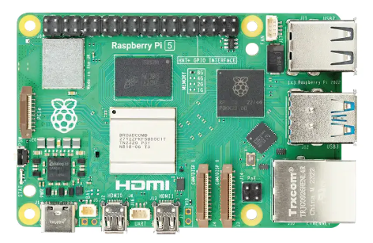 | 1 | [Official Page](https://www.raspberrypi.com/products/raspberry-pi-5/) |
| RRC Lite Controller |  | 1 | [Official Page](https://www.hiwonder.com/products/rrc-lite) <br> *(Part of [MentorPi A1 kit](https://www.hiwonder.com/products/mentorpi-a1-monocular-camera-version?variant=41370001244247))*|
| Control Board for LiDAR |  | 1 | *(Part of [MentorPi A1 kit](https://www.hiwonder.com/products/mentorpi-a1-monocular-camera-version?variant=41370001244247) and [LiDAR kit](https://www.hiwonder.com/products/ld19-d300-lidar?_pos=1&_sid=6968f314c&_ss=r) )*|
| **Sensors** | | | |
| STL-19P D500 LiDAR | 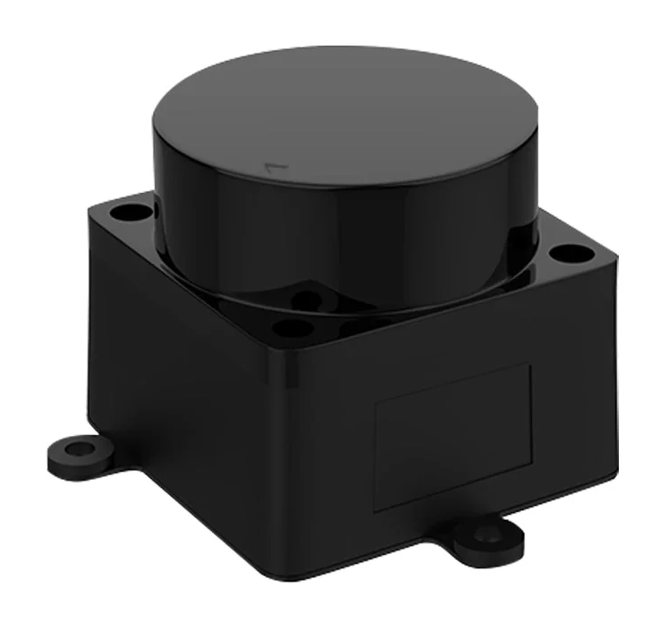 | 1 | [Product Page](https://www.hiwonder.com/products/ld19-d300-lidar?_pos=1&_sid=6968f314c&_ss=r) <br> *(Part of [MentorPi A1 kit](https://www.hiwonder.com/products/mentorpi-a1-monocular-camera-version?variant=41370001244247))*|
| 2DOF Monocular Camera | 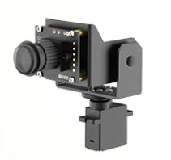 | 1 | [Product Page](https://www.hiwonder.com/products/mentorpi-a1-monocular-camera-version?variant=41370001244247) <br> *(Part of [MentorPi A1 kit](https://www.hiwonder.com/products/mentorpi-a1-monocular-camera-version?variant=41370001244247))*|
| BNO055 IMU | 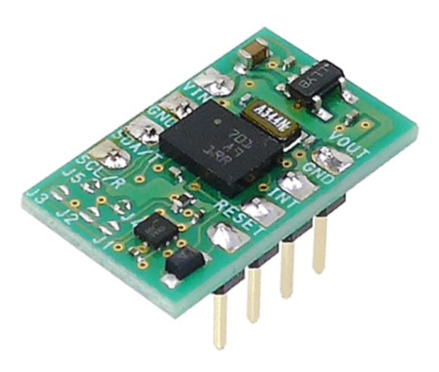 | 1 | [Product Page](https://akizukidenshi.com/catalog/g/g116996/) |
| **Propulsion & Steering System** | | | |
| DC Geared Motor w/ Encoder| | 1 | [Product Page](https://www.hiwonder.com/products/hall-encoder-dc-geared-motor?variant=40451123675223) <br> *(Part of [MentorPi A1 kit](https://www.hiwonder.com/products/mentorpi-a1-monocular-camera-version?variant=41370001244247))*|
| Hiwonder LFD-01 Servo| 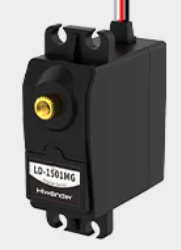 | 1 | [Product Page](https://www.aliexpress.com/i/3256805777087496.html?gatewayAdapt=jpn2glo4itemAdapt) <br> *(Part of [MentorPi A1 kit](https://www.hiwonder.com/products/mentorpi-a1-monocular-camera-version?variant=41370001244247))*|
| **Power System** | | | |
| 7.4V 2200mAh LiPo Battery| 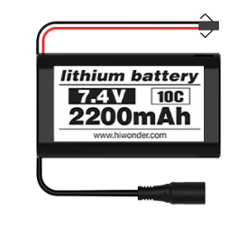 | 1 | *(Part of [MentorPi A1 kit](https://www.hiwonder.com/products/mentorpi-a1-monocular-camera-version?variant=41370001244247))* |
| **Mechanical Components** | | | |
| Differential Gears |  | 1 | [Product Page](https://www.aliexpress.com/i/3256803487389220.html?gatewayAdapt=4itemAdapt) |
| Wheels & Tires | 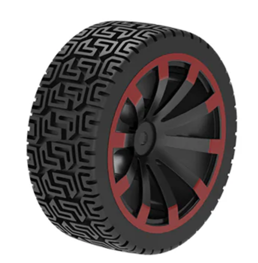 | 4 | *[Product Page](https://www.hiwonder.com/products/mecanum-omnidirectional-wheel-metal-coupling-motor-ros-robot-universal-wheel-smart-car-tire?_pos=3&_sid=f4084b157&_ss=r&variant=40446400659543) <br> (Part of [MentorPi A1 kit](https://www.hiwonder.com/products/mentorpi-a1-monocular-camera-version?variant=41370001244247))* |
| **Custom 3D-Printed Parts** | | | |
| Base Mounting Plate | 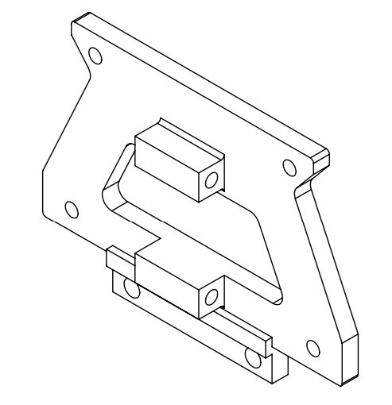 | 1 | [3D Model](models/3D_CAD_data/bottom-plate.SLDPRT) / [Blueprint](models/blueprints/bottom-plate.pdf) |
| LiDAR Mount (Mid Frame) | 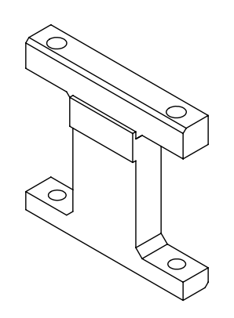 | 1 | [3D Model](models/3D_CAD_data/LiDAR-mid.SLDPRT) / [Blueprint](models/blueprints/LiDAR-mid.pdf) |
| LiDAR Mount (Upper Frame)| 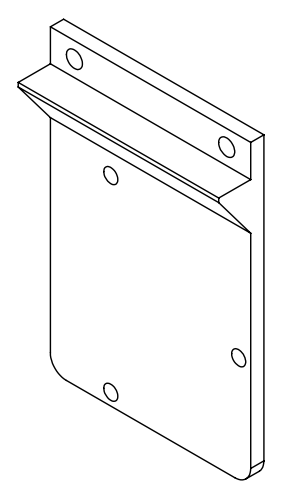| 1 | [3D Model](models/3D_CAD_data/LiDAR-upper.SLDPRT) / [Blueprint](models/blueprints/LiDAR-upper.pdf) |
| Camera Tower (Side Frames)| 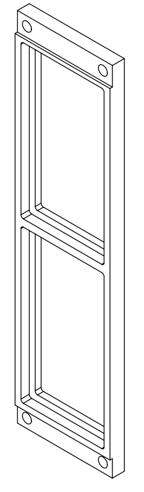| 2 | [3D Model](models/3D_CAD_data/cam-side-short.SLDPRT) / [Blueprint](models/blueprints/cam-side-short.pdf) |
| Camera Mount (Upper) | 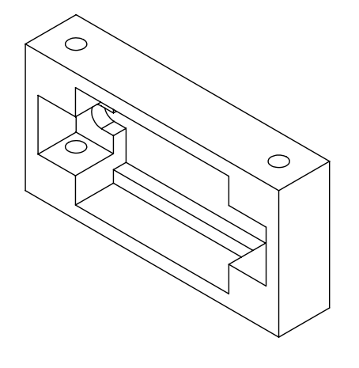 | 1 | [3D Model](models/3D_CAD_data/cam-upper.SLDPRT) / [Blueprint](models/blueprints/cam-upper.pdf) |
| Differential Gearbox | 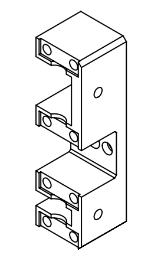 | 1 | [3D Model](models/3D_CAD_data/gearbox.SLDPRT) / [Blueprint](models/blueprints/gearbox.pdf) |
| Bevel Gear | 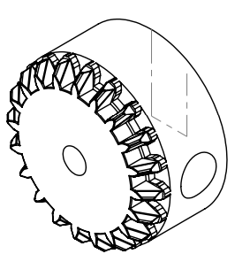 | 1 | [3D Model](models/3D_CAD_data/Bevel_Gear.SLDPRT) / [Blueprint](models/blueprints/Bevel_Gear.pdf) |
| Wheel Hub | 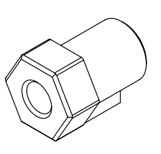 | 2 | [3D Model](models/3D_CAD_data/hub.SLDPRT) / [Blueprint](models/blueprints/hub.pdf) |
| Wheel Sleeve | 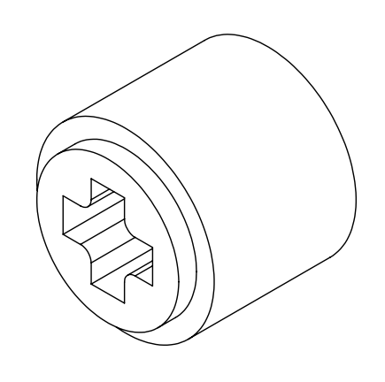 | 2 | [3D Model](models/3D_CAD_data/sleeve.SLDPRT) / [Blueprint](models/blueprints/sleeve.pdf) |

*(Note: This list covers the main components. A complete list including smaller parts like wires, screws, and bearings is omitted for brevity.)*

---

## 4. Vehicle Overview & Photos

A high-level introduction to our robot's design philosophy and key features.

| Front_View | Right_View | Rear_View |
| :--: | :--: | :--: |
|  |  |  |
| Left_View | Top_View | Bottom_View |
|  |  |  |

---             

## 5. Mobility Management

This section details our robot's mechanical framework, its propulsion system, and the mechanisms for directional control. Our design philosophy emphasizes precision, stability, and agile control on the competition field.

### 5.1. Chassis Design

Our robot's development began with the **Hiwonder MentorPi A1** as a base platform, which we selected for its robust initial structure. However, through extensive testing and iteration, our design has evolved into a **unique, custom chassis** that, while inspired by the original, is now tailored specifically to our strategic needs.

### 5.2. Drive Mechanism: Single Motor with Differential Gearbox

**Development Story:**
The original base vehicle utilized a two-motor drive system for the rear wheels. However, we identified that this configuration could be interpreted as an electronic "differential," which is not permitted under the competition rules. To ensure full compliance while maintaining high performance, we engineered a significant modification: a **single-motor drive system** that transmits power through a mechanical **differential gearbox**.

*   **Role of the Differential Gearbox:** This crucial mechanical component distributes power from the single motor to both rear wheels. It allows the wheels to rotate at different speeds during a turn, which is essential for smooth and stable cornering and works in perfect harmony with our steering system.
*   **Motor and Encoder:** The heart of our propulsion is a **DC geared motor with an integrated Hall-effect encoder**. This encoder outputs A/B phase pulse signals, which our system decodes to precisely determine the motor's direction and rotational speed. This high-resolution feedback is the foundation of our accurate PID speed control.

<p align="center">
  
  <br>
  <em>Our custom single-motor and differential gearbox assembly.</em>
</p>

**Motor Selection Rationale:**
We selected this specific motor for three key reasons:
1.  **Integrated Encoder:** The built-in high-resolution encoder provides the precise feedback necessary for advanced PID speed control, eliminating the need for external sensors.
2.  **High Torque:** The 1:20 gear ratio provides sufficient torque to ensure powerful acceleration and stable performance, even on slight inclines.
3.  **Compact Form Factor:** Its compact size was ideal for our custom-designed, single-motor chassis, allowing for a clean and efficient mechanical layout.

**Motor Specifications:**
<p align="center">
  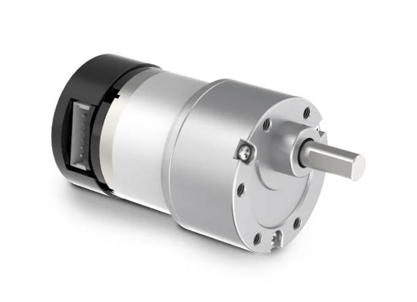
  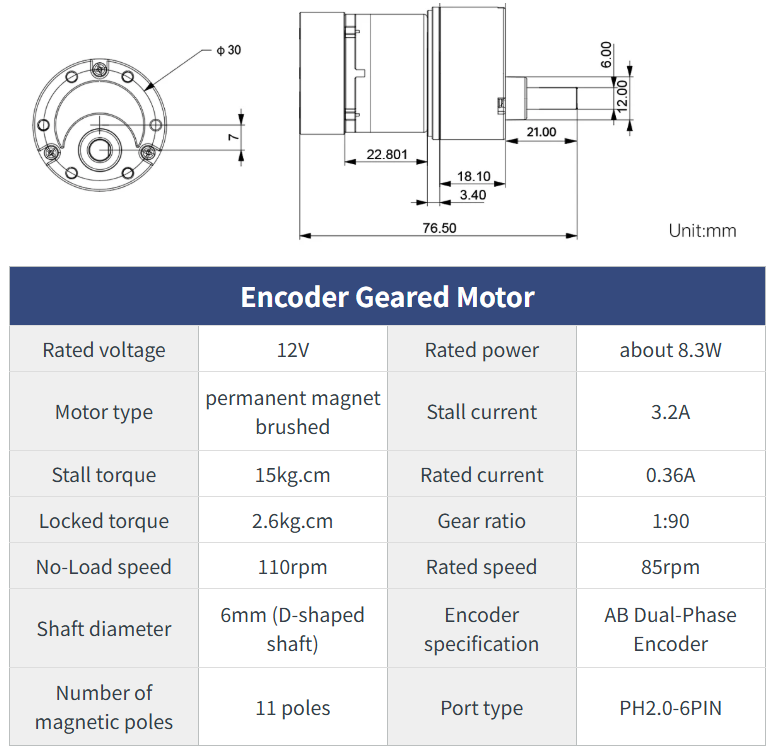<br>
  <em>Image and specifications sourced from <a href="https://www.hiwonder.com/products/hall-encoder-dc-geared-motor?variant=40451123675223">Hiwonder's official product page</a>.</em>
</p>

### 5.3. Steering Mechanism: Modified Ackermann Geometry

To maximize our robot's agility, we modified the stock **Ackermann steering mechanism** provided by the base vehicle. Our primary goals were to **increase the maximum steering angle** and improve overall turning precision.

*   **Principle:** The Ackermann geometry is designed so that during a turn, the inner front wheel pivots at a sharper angle than the outer wheel. This ensures that the normal lines of all four wheels intersect at a single Instantaneous Center of Rotation (ICR), minimizing tire slippage.
*   **Effect:** By adhering to this principle while modifying the linkage for a greater steering range, we have achieved exceptionally smooth and predictable cornering, especially in tight turns. This allows for more energy-efficient and faster navigation through the course.

The steering is actuated by a **Hiwonder LFD-01 Anti-blocking Servo**.

**Servo Selection Rationale:**
Our choice of this servo was deliberate, focusing on reliability and power.
1.  **High Torque & Metal Gears:** To handle the stresses of rapid, precise steering adjustments at speed, we needed a servo with high torque and durable metal gears. This prevents gear stripping, a common failure point with standard servos.
2.  **Anti-Blocking Feature:** This servo includes a built-in protection circuit that prevents damage if the steering mechanism becomes stalled or blocked, significantly increasing the robot's overall robustness during long runs.

**Motor Specifications:**
<p align="center">
  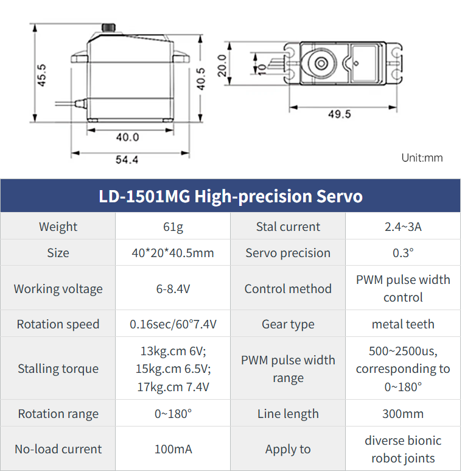<br>
<em>Image and specifications sourced from <a href="https://www.hiwonder.com/products/ackermann-steering-chassis?variant=40382428348503">Hiwonder's official product page</a>.</em>
</p>


#### Kinematic Model

To mathematically model our robot's motion and ensure pure rolling without lateral slip, we applied the following kinematic principles based on the Ackermann model.

<p align="center">
  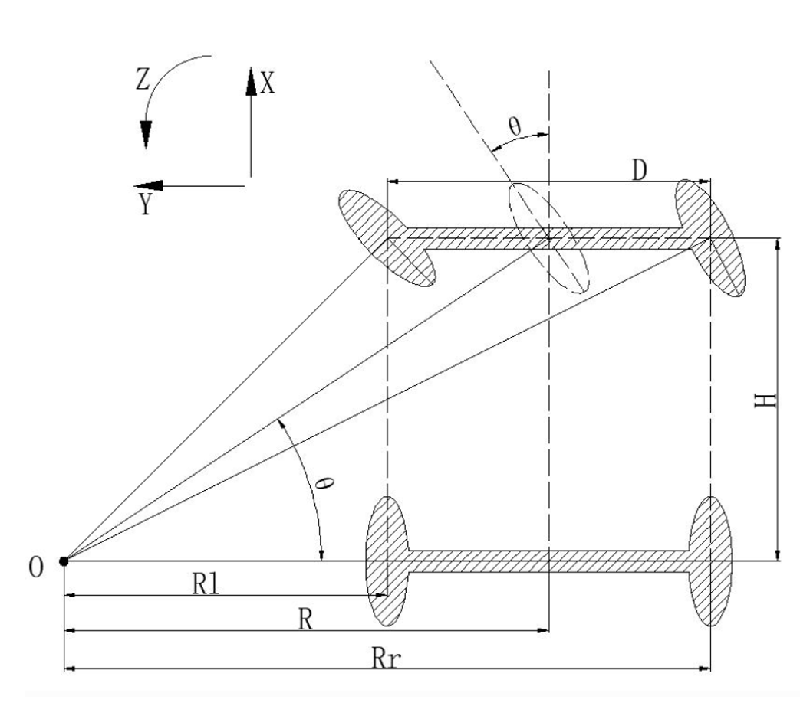
</p>

**Key Parameters:**
*   **θ:** Front wheel steering angle (rad).
*   **V:** Linear velocity of the vehicle (m/s), with V<sub>L</sub> and V<sub>R</sub> being the left and right rear wheel velocities.
*   **D:** Track width of the vehicle (m).
*   **H:** Wheelbase of the vehicle (m).
*   **R:** Turning radius of the vehicle (m), with R<sub>L</sub> and R<sub>R</sub> being the radii for the left and right wheels.
*   **ω:** Angular velocity of the vehicle (rad/s).

**Core Formulas:**

1.  **Angular Velocity Consistency:** The angular velocity is consistent across the vehicle.
    <p align="center">
      
    </p>

2.  **Relationship between Steering Angle and Turning Radius:** The turning radius is geometrically related to the steering angle and wheelbase.
    <p align="center">
      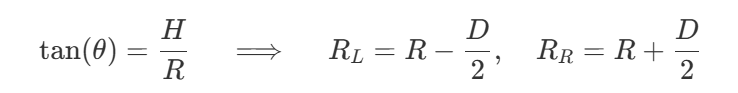
    </p>
    
3.  **Individual Wheel Velocities:** By knowing the wheelbase, track width, vehicle speed, and servo steering angle, we can calculate the required velocity for each rear wheel. This difference in speed is physically realized by our differential gearbox.
    *   **Left Wheel Velocity (V<sub>L</sub>):**
        <p align="center">
          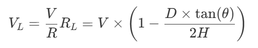
        </p>

    *   **Right Wheel Velocity (V<sub>R</sub>):**
        <p align="center">
          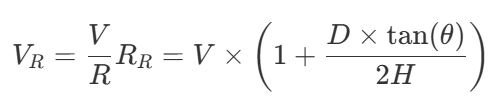
        </p>

This mathematical model is fundamental to how our `ros_robot_controller` translates high-level velocity commands into precise, differential wheel speeds, enabling accurate path following.


### 5.4. Optimization via Custom 3D-Printed Parts

To fully unleash the potential of our base vehicle and physically support our navigation strategy, we designed and 3D-printed several custom mounts using CAD software. These parts are not mere accessories; they are the result of careful engineering decisions aimed at maximizing sensor data quality and overall performance.

*   **LiDAR Mount:**

    **Objective:** 
    
    To achieve accurate wall detection while minimizing physical interference.

    **Design:** 
    
    We engineered a multi-purpose mount with two key features. First, it positions the LiDAR at an optimal low height and slightly forward, ensuring its lasers are perfectly aligned with the course walls for the highest quality data. Second, the mount supports the LiDAR from above, allowing it to be **installed in an inverted position**. This orientation reduces the risk of the mount itself colliding with obstacles. This inverted mounting concept was **inspired by the design of last year's Future Engineers world champion team**, demonstrating our commitment to learning from the best.

*   **Camera Tower:**

    **Objective:**
    
    To ensure a clear, unobstructed view of all obstacles.

    **Design:**
    
    We developed a tall tower structure that elevates the camera, providing a top-down, "bird's-eye" perspective of the obstacles. This prevents the robot's own chassis from blocking the camera's line of sight, which is crucial for the reliable object recognition performed in our `PLAN_NEXT_AVOIDANCE` phase.

These custom modifications form the critical physical foundation that enables our software to perform at its peak. All 3D models for these parts, including our custom chassis and gearbox components, are available in the [`models`](models) directory. To facilitate the reproduction of our design, we have also provided **detailed blueprints and assembly diagrams** for these custom parts in the [`models\blueprints`](models/blueprints) directory.

<p align="center">
  
  <br>
  <em>Our custom-designed LiDAR mount and camera tower, engineered for optimal sensor performance.</em>
</p>

---

## 6. Power and Sense Management

This section details the robot's "lifeline," its power system, and its "senses," the suite of sensors that enables it to perceive the environment. A stable power supply and accurate environmental awareness are the most critical physical foundations for our autonomous navigation strategy.

### 6.1. Power System

**The Challenge:**
An autonomous robot must reliably power a powerful computational core (SBC), multiple sensors, and high-torque motors simultaneously. A significant challenge is the voltage drop that occurs during motor acceleration, which can lead to critical failures like SBC reboots or sensor errors.

**Our Solution:**
To overcome this, we have built a robust power system by combining reliable, high-performance components.

**1. Battery Selection:**
Our primary power source is a **7.4V 2200mAh 10C LiPo Battery**.

*   **Selection Rationale:**
    *   **Sufficient Capacity:** The 2200mAh capacity ensures stable performance throughout the entire duration of a competition run.
    *   **High Discharge Rate:** A high C-rate of `10C` allows the battery to comfortably handle the large peak currents demanded by the motors during acceleration, minimizing voltage drops.
    *   **Integrated BMS:** The battery includes a built-in Battery Management System (BMS) that protects against over-charge, over-discharge, over-current, and short circuits, significantly enhancing safety during testing and competition.

<p align="center">
  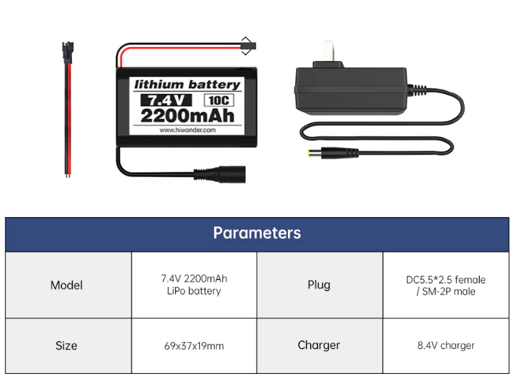
</p>

**2. Power Distribution and Stabilization:**
Power from the battery is distributed to our main components—the **Raspberry Pi, motors, and LiDAR**—via the **Hiwonder RRC Lite Controller**.

*   **Role:** This controller acts as an intelligent hub, providing stable, regulated power to these power-hungry components.
*   **Key Advantage:** A critical feature of this controller is its support for the **Power Delivery (PD) protocol**, enabling it to supply a stable **5V/5A** current to the Raspberry Pi 5. This powerful supply capability isolates the Raspberry Pi from voltage sags caused by motor operation, eliminating the risk of unexpected shutdowns or system instability. This forms the bedrock of our robot's high reliability.

<p align="center">
  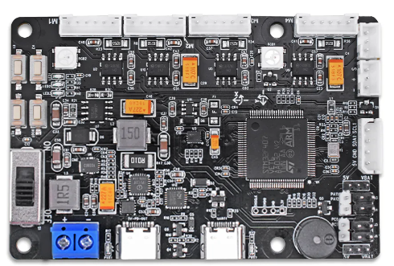
</p>

### 6.2. Sensor Suite

Our robot fuses data from multiple sensors, each with a distinct role, to build a comprehensive and accurate understanding of its environment. All sensor data is aggregated in real-time by our main `ObstacleNavigatorNode` via ROS 2 topics to inform its navigation decisions.

#### STL-19P D500 LiDAR

<p align="center">
    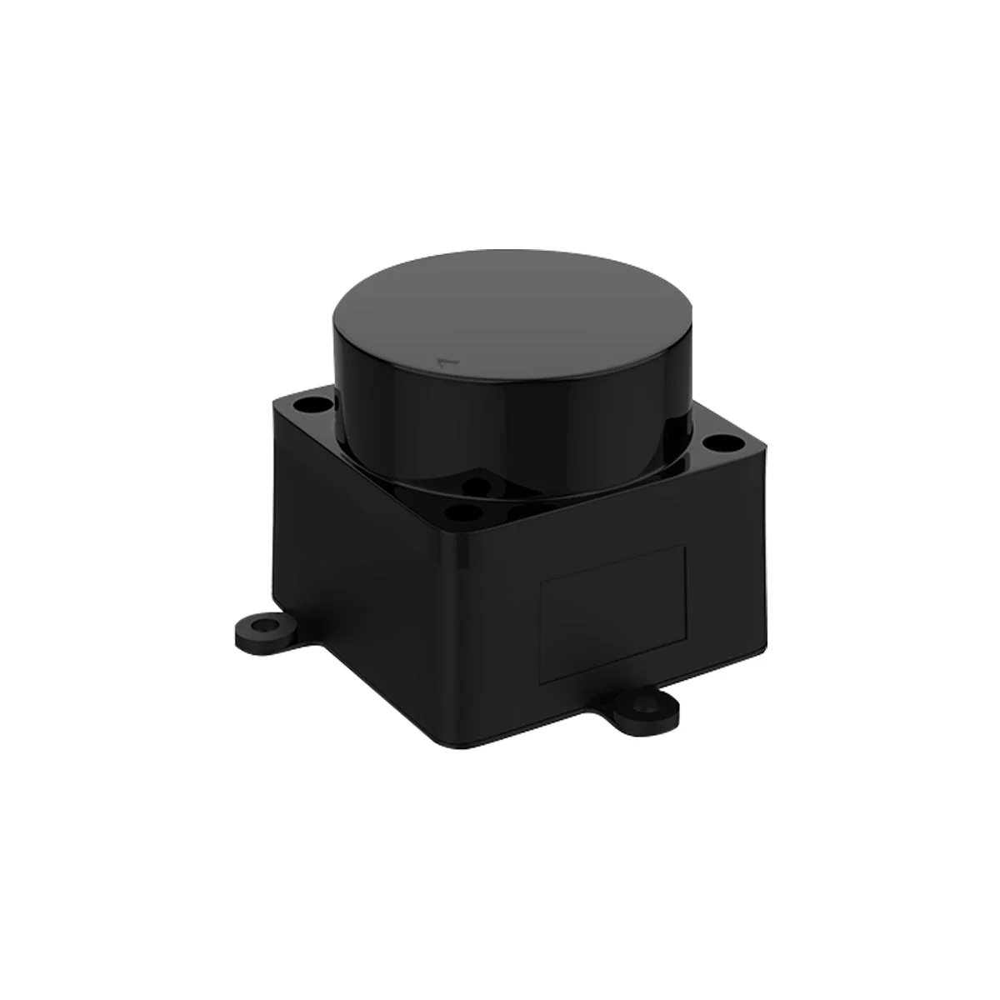
    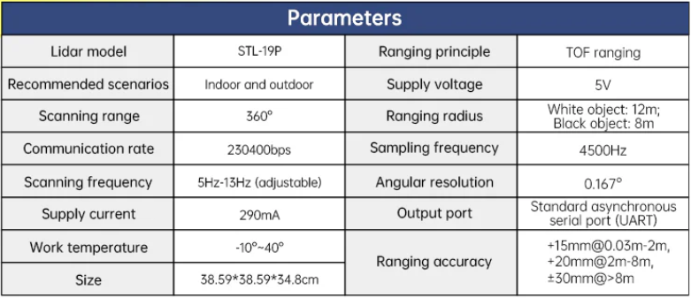
    <em><br>Image and specifications sourced from the <a href="https://www.hiwonder.com/products/ld19-d300-lidar?_pos=1&_sid=6968f314c&_ss=r">official product page</a>.</em>
</p>


**Role:** This is our primary sensor for environmental mapping. It provides 360-degree distance information, which is fundamental for wall detection, corner detection, and initial obstacle localization.

*   **Selection Rationale:** We chose this model for its high-speed, 360-degree scanning capability and its excellent ROS 2 driver support, which facilitated easy integration. Its TOF (Time of Flight) technology also ensures stable and reliable measurements.
*   **Software Integration:** Data from the `/scan` topic is fused with IMU data in our `get_distance_at_world_angle()` function. This corrected data serves as the core input for our `_execute_pid_alignment()` (wall-following) and `_check_for_corner()` (corner detection) algorithms.

*Code Snippet: Subscribing to LiDAR Data*
```python
# This code in __init__ starts listening to the /scan topic.
# The scan_callback function is called every time new data arrives.
self.scan_subscriber = self.create_subscription(
    LaserScan, 
    '/scan', 
    self.scan_callback, 
    qos_profile_lidar
)
```

#### 2DOF Monocular Camera

<p align="center">
    
    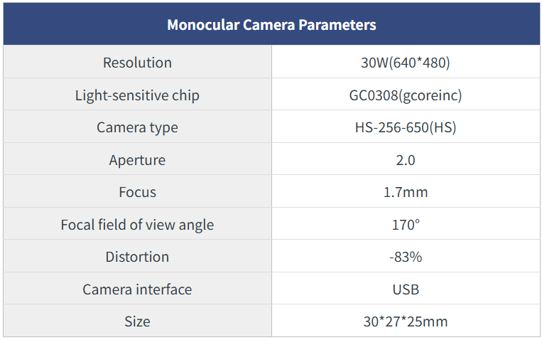
    <em><br>Image and specifications sourced from the <a href="https://www.hiwonder.com/products/mentorpi-a1-monocular-camera-version?variant=41370001244247">official product page</a>.</em>
</p>

**Role:** Our vision sensor, used exclusively for identifying the **color** of obstacles.

*   **Selection Rationale:** The 170° wide-angle lens is a key feature, allowing the robot to capture a broad view of the upcoming segment during its corner scans. Its USB interface and ROS 2 compatible driver ensure seamless integration with the Raspberry Pi.
*   **Software Integration:** Image frames from the `/ascamera/...` topic are processed during the `PLAN_NEXT_AVOIDANCE` phase. Using OpenCV, we detect red and green blobs and compare their areas to determine the `avoidance_path_plan` for the next segment.

*Code Snippet: Subscribing to Camera Data*
```python
# This code in __init__ subscribes to the camera's image topic.
# The image_callback function processes the incoming video frames.
self.image_sub = self.create_subscription(
    Image, 
    '/ascamera/camera_publisher/rgb0/image', 
    self.image_callback, 
    qos_profile_img
)
```

#### IMU (BNO055)

<p align="center">
    
    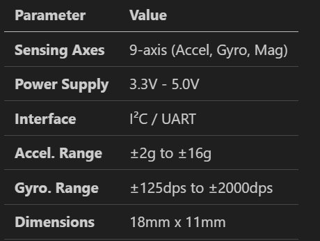
    <em><br>Image and specifications sourced from the <a href="https://akizukidenshi.com/catalog/g/g116996/">official product page</a>.</em>
</p>

**Role:** This Inertial Measurement Unit measures the robot's orientation (yaw angle), acting as a crucial component that dramatically enhances navigation precision.

*   **Selection Rationale:** Although the RRC Lite Controller has an onboard IMU, we opted for the external BNO055 for its superior accuracy and stability. Its internal 9-axis sensor fusion algorithms provide a reliable, low-drift heading estimate.
*   **Software Integration:** The yaw data from the `/imu/yaw` topic is **essential for correcting the LiDAR data** in our `get_distance_at_world_angle()` function. This is how we overcome the "Black Wall Problem," ensuring accurate wall distance measurements regardless of the robot's orientation.

*Code Snippet: Subscribing to IMU Data*
```python
# This code in __init__ subscribes to the IMU's yaw topic.
# The yaw_callback function updates the robot's current heading.
self.yaw_subscriber = self.create_subscription(
    Float64, 
    '/imu/yaw', 
    self.yaw_callback, 
    10
)
```

### 6.3. Wiring Diagram

The following diagram illustrates the complete electrical connections between our core components, including the Raspberry Pi, RRC Lite Controller, battery, and all sensors. This centralized wiring, managed by the RRC Lite Controller, simplifies the overall structure and enhances reliability by minimizing potential points of failure.

<p align="center">
  
</p>

A detailed list of all the components shown in this diagram is available in [**Section 3: Bill of Materials (BOM)**](#3-bill-of-materials-bom).

---

## 7. Obstacle Management Strategy

This is the core of our autonomous navigation logic, implemented in the `obstacle_navigator_node.py`.

### 7.1. Overall Strategy: A Hierarchical State Machine

To navigate the complex and dynamic environment of the WRO course, our robot employs a **Hierarchical State Machine (HSM)**. This software architecture allows us to systematically manage the robot's behavior by breaking down the overall task into a series of distinct, manageable states. The robot always knows its current state and transitions to the next state based on clear, predefined conditions derived from sensor data.

This approach ensures robust, predictable, and debuggable behavior. The system is built around six main states, each responsible for a specific phase of the mission.

**Main States Overview:**

*   **`PREPARATION`**: Initializes all systems, including the camera and sensors, and determines the overall course direction (CW/CCW) at the start. (Parking Start Only)
*   **`UNPARKING`**: Executes a dynamic, pre-planned strategy to safely exit the parking area and enter the main course. (Parking Start Only)
*   **`STRAIGHT`**: The primary driving state. The robot follows the wall using PID control, detects upcoming corners, and plans its avoidance strategy for the next segment.
*   **`TURNING`**: Executes a precise, multi-step pivot turn to navigate the 90-degree corners of the course.
*   **`PARKING`**: Upon completing the required number of laps, this state manages the final maneuver to park the robot safely in the designated area.
*   **`FINISHED`**: The final state where all motors are stopped, concluding the run.

The core of our robot's operation is the cyclical transition between the `STRAIGHT` and `TURNING` states, which allows it to repeatedly navigate the course segments and corners.

**High-Level State Transition Flowchart:**

<p align="center">
    
</p>

### 7.2. The ROS 2 Ecosystem: How Our Nodes Collaborate

Our autonomous navigation system is built entirely on the **Robot Operating System 2 (ROS 2)**, an advanced, open-source framework for robotics. ROS 2 allows us to structure our software in a modular and robust way, where independent programs called **Nodes** communicate with each other in real-time.

The core of this communication is the **Publish/Subscribe (Pub/Sub)** model. Sensor nodes "publish" data onto named channels called **Topics**, and our main logic node "subscribes" to these topics to receive the data. Similarly, our logic node publishes control commands, which the motor controller node subscribes to. This decoupled architecture makes the system highly flexible, scalable, and easy to debug.

Our system consists of three primary nodes that work in concert:

1.  **Sensor Drivers Node(s):** Responsible for interfacing with the hardware (LiDAR, IMU, Camera) and publishing their raw data to ROS 2 topics.
2.  **`ObstacleNavigatorNode` (The Brain):** This is the central logic node that we developed. It subscribes to all sensor data, processes it through the hierarchical state machine, makes decisions, and publishes velocity and servo commands.
3.  **Motor Controller Node (`ros_robot_controller`):** This node subscribes to the commands from our "Brain" and translates them into low-level electrical signals to control the motors and servos.

The following diagram illustrates the flow of data between these nodes.

**Node and Topic Communication Diagram:**

<p align="center">
    
</p>

### 7.3. Dynamic Strategy Selection

A key feature of our robot is its ability to dynamically select the optimal strategy in real-time, rather than following a single, hard-coded path. This adaptability is crucial for handling the various challenges on the course. We have implemented two primary dynamic selection systems: one for unparking and one for cornering.

#### 7.3.1. Unparking Strategy (4 Patterns)

**The Challenge:** Our initial approach was to exit the parking area first and then identify the obstacle color, but this resulted in significant time loss and inefficient movements. We realized that since the obstacle is visible from the starting position, a pre-emptive scan could optimize the entire sequence. The problem then became how to reliably select an exit strategy before moving, using only a single, potentially noisy, initial observation.

**Our Solution:** To address this, our robot executes a pre-unparking check to gather data and select one of four specialized exit strategies.

1.  **Direction Detection:** The robot first uses its LiDAR to determine the course direction by measuring the distance to the side walls.
2.  **Obstacle Proximity Scan:** It then aims its camera towards the exit and analyzes the size of the detected obstacle blob to determine if it is "close" or "far".
3.  **Strategy Selection:** Based on these two pieces of information, the robot selects the most appropriate strategy from the following decision matrix:

| Course Direction | Obstacle Presence | Selected Strategy | Description |
| :--- | :--- | :--- | :--- |
| **Clockwise** | Far | `STANDARD_EXIT_TO_OUTER_LANE` | A standard turn onto the wider outer lane. |
| **Clockwise** | Far (Red Obstacle) | `STANDARD_EXIT_TO_INNER_LANE` | A standard turn onto the tighter inner lane. |
| **Clockwise** | Close (Red Obstacle) | `AVOID_EXIT_OBSTACLE_TO_INNER_LANE_CW` | A complex maneuver involving a forward push and turn to clear the obstacle. |
| **Counter-Clockwise**| Far | `STANDARD_EXIT_TO_OUTER_LANE` | A standard turn onto the wider outer lane. |
| **Counter-Clockwise**| Close | `AVOID_EXIT_OBSTACLE_TO_INNER_LANE_CCW`| A reverse maneuver to create space before turning onto the inner lane. |

<p align="center">
    
</p>

This intelligent selection process ensures a safe and efficient exit from the parking area, regardless of the initial conditions.

#### 7.3.2. Obstacle Planning Strategy: Proactive Corner Scanning

**The Challenge:**
Simply reacting to obstacles as they appear during high-speed driving is inefficient and risky. It takes too long to detect and process obstacles in real-time, leading to abrupt stops and suboptimal paths.

**Our Solution:**
Instead of reacting, we adopted a **proactive planning strategy**. Before entering a straight segment, the robot stops at the corner, scans the entire upcoming segment for obstacles, and decides on a complete path plan in advance. This "scan-then-drive" approach has a powerful advantage: the obstacle layout is determined only on the first lap, and this plan is reused on subsequent laps, allowing for much faster, smoother, and more confident driving.

This planning phase consists of three key steps:

1.  **Pre-Scan Positioning:**
    On the first lap, upon detecting a corner, the robot doesn't immediately turn. Instead, it precisely positions itself at a safe, optimal vantage point. Using its IMU for orientation correction, it aims its camera directly down the upcoming straight segment, ensuring a clear and stable view for the scan.

2.  **"Move-and-Scan" with Max-Blob Detection:**
    After positioning, the robot creeps forward very slowly while its camera continuously scans the segment. For each frame, it detects red and green obstacle "blobs" and calculates their area. To guard against sensor noise or fleeting changes in lighting, we don't rely on a single image. Instead, the final decision is based on the **largest blob area detected across the entire scan period**. This max-blob approach makes our detection system extremely robust. During this phase, the robot also specifically determines if an obstacle is blocking the entrance to the segment.

<p align="center">
  
  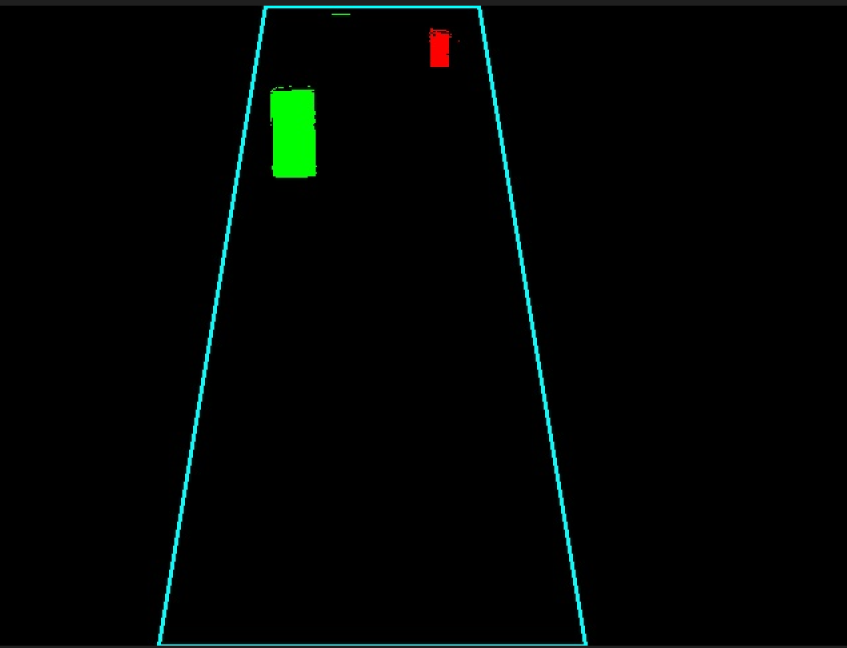
  <br>
  <em>Left: The raw camera view during a proactive scan. Right: The processed result, where only the detected red and green blobs are isolated for area calculation.</em>
</p>

The data from this scan is then analyzed to make a final decision. The image below shows the actual log output from our robot's analysis process. Over a scan of 36 frames, it found the largest green blob (area: 2122.0) to be significantly larger than the largest red blob and the detection threshold, leading to the final decision of a `'green_to_red'` obstacle pattern.

<p align="center">
  
  <br>
  <em>The actual log output, showing the data-driven decision process.</em>
</p>

3.  **Path Plan Generation (4 Patterns):**
    The result of the scan (e.g., "red only," "green-to-red") is combined with the current driving direction (CW/CCW) to select one of four possible avoidance plans for the next segment: `outer-only`, `inner-only`, `outer-to-inner`, or `inner-to-outer`. This decision is stored in our `avoidance_path_plan` array. This array acts as a complete "blueprint" for the course, enabling the robot to navigate smoothly on the second and third laps by simply referencing the plan without needing to scan again.

#### 7.3.3. Straight Strategy: PID Control and Obstacle Avoidance

**The Challenge:** The "straight" segments of the course are the most critical sections, as this is where obstacles are physically present. The robot must perform two core tasks in tandem: maintaining a precise, stable trajectory along a wall, while simultaneously executing smooth maneuvers to bypass these obstacles.

**Our Solution:** The `STRAIGHT` state is our answer to this challenge. Its logic is composed of three primary actions that work together to achieve fast and safe navigation.

1.  **Wall Approach (The "Turn-In" Maneuver):**
    This is the first and most crucial phase of obstacle avoidance. Instead of attempting to swerve around an obstacle, the robot executes a deliberate **"Turn-In"** maneuver (`AVOID_*_TURN_IN` sub-state). It purposefully steers towards the opposite wall at a sharp, predefined angle. This action proactively creates the necessary space to bypass the upcoming obstacle safely and predictably.

2.  **PID Wall-Following (Align and Pass):**
    This is the core of our stable driving logic. Whether driving normally or passing an obstacle, the robot uses a robust **PID (Proportional-Integral-Derivative) controller**. This system continuously fuses data from the **IMU** (for heading) and **LiDAR** (for distance) to make constant, minute steering corrections. This allows the robot to maintain a precise distance from its reference wall, ensuring a perfectly straight and stable trajectory. During an avoidance maneuver, this same logic is used to align with the *opposite* wall and glide past the obstacle.

<p align="center">
  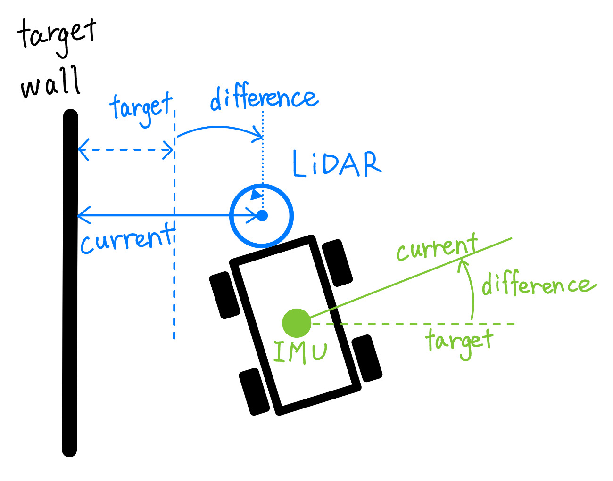
  <br>
  <em><b>For the case shown in this image,</b> the PID controller calculates two opposing commands. The <b>LiDAR</b>, detecting the robot is too far, generates a <em>Distance Error</em> commanding a <b>turn to the left</b>. Simultaneously, the <b>IMU</b>, detecting the inward angle, generates a <em>Heading Error</em> commanding a <b>turn to the right</b>. The final steering output is a weighted sum of these values, resulting in a smooth correction back to the target path.</em>
</p>

3.  **Lane Change for Complex Scenarios:**
    For the most challenging course layouts, our robot employs advanced lane change logic. **If both a red and a green obstacle exist within the same straight segment, the robot will execute a full lane change maneuver after clearing the first obstacle to position itself for the second.** This corresponds to our pre-planned strategies like `outer_to_inner` and ensures the robot can fluidly navigate even the most complex obstacle combinations without stopping.


#### 7.3.4. Turning Strategy (8 Patterns)

**The Challenge:** Simply making a 90-degree turn at every corner is inefficient. The optimal turning maneuver (e.g., approach distance, turn angle) depends on the robot's current path, its planned path for the *next* segment, and any obstacles present at the corner's entrance.

**Our Solution:** Our `_get_turn_strategy()` function acts as a dynamic decision-maker before every turn. It analyzes three key factors to select the best set of turning parameters from 8 possible combinations:

1.  **Current Lane:** Is the robot currently on the `Outer` or `Inner` path?
2.  **Next Lane Plan:** Is the plan for the next segment `Outer`, `Inner`, `Outer-to-Inner`, or `Inner-to-Outer`?
3.  **Entrance Obstacle:** Is there an obstacle detected at the entrance of the corner that requires a wider turn?

Based on these factors, the robot adjusts its behavior, allowing for tighter, faster turns when the path is clear, and safer, wider turns when navigating complex transitions or obstacles. This logic is the core of our robot's lap-time performance and reliability.

<p align="center">
    
</p>
<p align="center">
    
</p>


### 7.4. Key Algorithms & Engineering Decisions

Our robot's reliability is not the result of a single piece of code, but the evolution of several key algorithms born from trial and error. This section details the engineering decisions behind our most critical navigation functions.

#### 7.4.1. State Definitions (Enums)

The foundation of our HSM is explicitly defined in the code using Python's `Enum` class. This approach provides a highly readable and robust way to manage the robot's state, as summarized in the table below.

| Class Name | Role in the State Machine |
| :--- | :--- |
| **`State` (Main States)** | Defines the highest-level phases of the robot's mission, such as `STRAIGHT` or `TURNING`. It represents the robot's major operational mode. |
| **Sub-State Enums**<br>(e.g., `StraightSubState`) | For each complex Main State, a corresponding Sub-State Enum breaks down the task into a sequence of smaller, manageable actions like `PLAN_NEXT_AVOIDANCE`. |
| **`UnparkingStrategy`** | Distinct from a state, this Enum defines the *strategic plan* selected during `PREPARATION`. It dictates which multi-step unparking sequence the robot will execute. |

**Code Snippets:**

The following code snippets from `obstacle_navigator_node.py` show how these concepts are implemented.

*Main States:*
```python
class State(Enum):
    PREPARATION = auto()
    UNPARKING = auto()
    STRAIGHT = auto()
    TURNING = auto()
    PARKING = auto()
    FINISHED = auto()
```
Example of Sub-States (for the STRAIGHT state):
```python
class StraightSubState(Enum):
    ALIGN_WITH_OUTER_WALL = auto()
    ALIGN_WITH_INNER_WALL = auto()
    PLAN_NEXT_AVOIDANCE = auto()
    PRE_SCANNING_REVERSE = auto()
    AVOID_OUTER_TURN_IN = auto()
    AVOID_INNER_TURN_IN = auto()
```

Example of a Strategy Definition:
```python
class UnparkingStrategy(Enum):
    STANDARD_EXIT_TO_OUTER_LANE = auto()
    AVOID_EXIT_OBSTACLE_TO_INNER_LANE_CCW = auto()
    UNDEFINED = auto()
```

This clear and explicit state definition is the key to our robot's reliable and predictable behavior.

#### 7.4.2. Initialization & Parameters (`__init__`)

The constructor of our `ObstacleNavigatorNode` (`__init__` function) is called once when the node launches. It is responsible for preparing all the necessary components and settings for the robot to operate.

The primary roles of the `__init__` function are as follows:

*   **Initializing State Variables:**
    It defines the initial state of the system, such as setting the starting state of our state machine to `PREPARATION`.

    ```python
    # Set the initial state for the state machine
    self.state = State.PREPARATION
    self.preparation_sub_state = PreparationSubState.WAITING_FOR_CONTROLLER
    ```

*   **Centralizing Tuning Parameters:**
    All tunable parameters that define the robot's behavior—such as driving speed, PID gains, and turning distances—are defined here. This centralizes all tuning work in one location, making the system highly maintainable.

    ```python
    # --- Driving & Speed Control ---
    self.forward_speed = 0.2
    # --- Alignment (PID) ---
    self.align_kp_dist = 7.5
    ```

*   **Setting up ROS 2 Communications:**
    It configures all the necessary ROS 2 communication channels, including Subscribers to receive sensor data and Publishers to send commands to the motors.

    ```python
    # Subscriber for LiDAR data
    self.scan_subscriber = self.create_subscription(
        LaserScan, '/scan', self.scan_callback, qos_profile_lidar)
    ```

*   **Starting the Main Control Loop:**
    Finally, it starts a 50Hz timer that repeatedly calls our main logic function, `control_loop_callback()`, effectively kicking off the autonomous control process.

    ```python
    # Create a timer to call the main control loop at 50Hz
    self.control_loop_timer = self.create_timer(
        1.0 / 50.0, self.control_loop_callback)
    ```

#### 7.4.3. Main Control Loop & State Dispatch

The `control_loop_callback()` function, triggered at 50Hz by the timer set in `__init__`, is the "heartbeat" of our autonomous system. With every call, the robot perceives its environment and decides its next action.

##### 7.4.3.1. Role as a Central Dispatcher

The design of this function is intentionally simple. Its sole responsibility is to act as a **central dispatcher**, delegating the actual work to specialized handler functions based on the robot's current state.

The process is straightforward:
1.  **Check the current main state** stored in the `self.state` variable (e.g., `State.STRAIGHT`).
2.  **Call the corresponding handler** using an `if/elif` structure (e.g., `_handle_state_straight()`).

```python
# The core of the main loop: a simple, clean state dispatcher.
def control_loop_callback(self):
    # ...
    if self.state == State.PREPARATION: 
        self._handle_state_preparation(msg) 
    elif self.state == State.UNPARKING:
        self._handle_state_unparking(msg) 
    elif self.state == State.STRAIGHT:
        self._handle_state_straight(msg)
    # ... and so on for all other main states
```

##### 7.4.3.2. Hierarchical Delegation

This delegation process is hierarchical. Each main state handler, such as _handle_state_straight(), further dispatches the task to a sub-state handler based on the current sub-state (e.g., StraightSubState.AVOID_OUTER_TURN_IN).

```python
# Inside a main state handler, it dispatches again to a sub-state handler.
def _handle_state_straight(self, msg):
    if self.straight_sub_state == StraightSubState.ALIGN_WITH_OUTER_WALL:
        self._handle_straight_sub_align_with_outer_wall(msg)
    elif self.straight_sub_state == StraightSubState.AVOID_OUTER_TURN_IN:
        self._handle_straight_sub_avoid_outer_turn_in(msg)
    # ... and so on for all other sub-states
```

This elegant structure of hierarchical delegation is the engine that drives our state machine. It keeps the main loop clean and allows the complex logic for each state to be neatly organized in its own dedicated function. The actual transitions between states (e.g., from STRAIGHT to TURNING) are managed within these handler functions based on sensor-driven conditions.


#### 7.4.4. Sub-State Handler Functions: Implementing the Behavior

The logic for each sub-state is implemented in its own dedicated handler function, following a clear `_handle_*_sub_*()` naming convention. This modular approach makes the system easy to read, debug, and maintain. The roles of the primary handler functions are summarized below.

##### System Startup (`PREPARATION` State)

This initial state is responsible for all startup checks and initial setup before the robot begins its main tasks.

| Sub-State | Handler Function | Functionality |
| :--- | :--- | :--- |
| **`WAITING_FOR_CONTROLLER`**| `_handle_preparation_sub_waiting_for_controller()` | Waits for the low-level motor controller to become ready before proceeding. |
| **`INITIALIZING_CAMERA`** | `_handle_preparation_sub_initializing_camera()` | Moves the camera servos to their default starting positions. |
| **`DETERMINE_DIRECTION`** | `_handle_preparation_sub_determine_direction()` | Determines the course direction (CW/CCW) by analyzing LiDAR data from the parking spot. |

##### Unparking (`UNPARKING` State)

This group of functions manages the sequence of safely exiting the parking area and entering the main course.

| Sub-State | Handler Function | Functionality |
| :--- | :--- | :--- |
| **`PRE_UNPARKING_DETECTION`** | `_handle_unparking_sub_pre_unparking_detection()` | Scans the exit for obstacles and selects one of the four `UnparkingStrategy` patterns. |
| **`INITIAL_TURN`** | `_handle_unparking_sub_initial_turn()` | Executes the initial turn to enter the course, based on the selected strategy. |
| **`AVOIDANCE_REVERSE`** | `_handle_unparking_sub_avoidance_reverse()` | (CCW Close-Obstacle Strategy) Reverses to create space before making the turn. |

##### Straight Driving and Planning (`STRAIGHT` State)

This is the most complex state, responsible for wall-following, planning for the next segment, and executing all obstacle avoidance maneuvers.

| Sub-State | Handler Function | Functionality |
| :--- | :--- | :--- |
| **`ALIGN_WITH_OUTER_WALL`** <br> **`ALIGN_WITH_INNER_WALL`** | `_handle_straight_sub_align_with_outer_wall()` <br> `_handle_straight_sub_align_with_inner_wall()` | The default driving mode. Uses the PID controller to maintain a precise distance from the designated (outer or inner) wall. |
| **`PLAN_NEXT_AVOIDANCE`** | `_handle_straight_sub_plan_next_avoidance()` | Executes the "Move-and-Scan" routine at a corner to detect obstacles and generate the `avoidance_path_plan`. (1st lap only) |
| **`AVOID_OUTER_TURN_IN`** <br> **`AVOID_INNER_TURN_IN`** | `_handle_straight_sub_avoid_outer_turn_in()` <br> `_handle_straight_sub_avoid_inner_turn_in()` | Initiates an avoidance maneuver by steering sharply towards the opposite wall (inner or outer) to create space. |
| **`PRE_SCANNING_REVERSE`** | `_handle_straight_sub_pre_scanning_reverse()` | Reverses the robot to a safe distance before starting the `PLAN_NEXT_AVOIDANCE` scan. |

##### Cornering (`TURNING` State)

This state executes a precise, multi-step maneuver to navigate the 90-degree corners of the course.

| Sub-State | Handler Function | Functionality |
| :--- | :--- | :--- |
| **`POSITIONING_REVERSE`** | `_handle_turning_sub_positioning_reverse()` | Reverses the robot to a standardized starting position to ensure consistent turns. |
| **`APPROACH_CORNER`** | `_handle_turning_sub_approach_corner()` | Moves forward towards the corner until it reaches the optimal distance to begin the pivot turn. |
| **`EXECUTE_PIVOT_TURN`** | `_handle_turning_sub_execute_pivot_turn()` | Executes a high-agility, fixed-angle pivot turn to change the robot's heading by approximately 90 degrees. |
| **`FINALIZE_TURN`** | `_handle_turning_sub_finalize_turn()` | Updates the turn counter and transitions the main state back to `STRAIGHT`. |

##### Parking (`PARKING` State)

This final set of maneuvers is responsible for bringing the robot to a safe and accurate stop in the designated parking area.

| Sub-State | Handler Function | Functionality |
| :--- | :--- | :--- |
| **`PRE_PARKING_ADJUST`** | `_handle_parking_sub_pre_parking_adjust()` | Precisely approaches the final pre-parking position, using an overshoot-and-reverse technique for CW to improve accuracy. |
| **`REVERSE_INTO_SPACE`** | `_handle_parking_sub_reverse_into_space()` | Executes the final reverse turn into the parking space until the target angle is reached. |

##### Mission End (`FINISHED` State)
The `FINISHED` state is the simplest of all. Its handler, `_handle_state_finished()`, has only one job: to publish a zero-velocity command, bringing the robot to a complete and safe stop. It also calculates and logs the total run time.

*(Note: Some legacy states like `DETERMINE_COURSE` have been omitted for clarity as they are not used in the primary parking-start mode.)*

### 7.4.5. Core Algorithms: The Intelligence Behind the Action

Beyond the state machine structure, the robot's intelligent behavior is driven by a few core algorithms. These functions are called repeatedly from the various sub-state handlers to perform complex tasks like stable navigation and reliable sensing.

**The "Aha!" Moment & Solution:** Through experimentation, we discovered that even the black walls provide reliable readings if, and only if, the laser hits them at a **perfect 90-degree angle**. This led to the development of our core sensor fusion function, `get_distance_at_world_angle()`.

This function uses the robot's real-time orientation from the **IMU** to continuously calculate the *exact LiDAR angle needed to hit the wall perpendicularly*, regardless of the robot's own orientation. By dynamically selecting the perfect laser beam at every moment, we transformed a "fatal flaw" of the LiDAR into a reliable navigation tool.

<p align="center">
    
</p>

```python
# --- Pseudo Code for IMU + LiDAR Sensor Fusion ---
def get_distance_at_world_angle(world_angle_deg, current_yaw_deg, scan_data):
    """Gets a reliable wall distance by correcting for the robot's orientation."""

    # --- This is the core of the fusion logic ---
    # To hit a wall at a specific "world" angle (e.g., 90 degrees),
    # calculate the angle the LiDAR must look at relative to the robot's own front.
    robot_local_angle = world_angle_deg - current_yaw_deg
    
    # Find the specific laser beam in the 360-degree scan that matches this local angle.
    lidar_index = find_lidar_index_for_angle(robot_local_angle, scan_data)
    
    # Get the primary distance measurement from that single, perfect beam.
    distance = scan_data.ranges[lidar_index]

    # As a fallback, if the primary beam failed (e.g., hit a seam in the wall),
    # check its immediate neighbors to get a valid reading.
    if not is_valid(distance):
        distance = check_neighboring_beams(lidar_index, scan_data)

    return distance
```


### 7.5. Source Code: A Modular ROS 2 Ecosystem

Our software is not a single script, but a complete, modular robotics application built on the **ROS 2 framework**. The entire system is organized into a collection of specialized ROS 2 packages, each with a distinct responsibility. This "separation of concerns" is a key principle of modern software engineering, making our system robust, maintainable, and easy to extend.

The directory tree below shows the high-level structure of our ROS 2 workspace, which is composed of our core logic packages and the necessary hardware drivers.

```
src
├─ driver/ # Low-level hardware drivers for the motor controller
├─ imu/ # Node for the external IMU sensor
├─ international_final/ # Core logic for the main obstacle challenge
├─ japan_final/ # Logic adapted for the Japan Final (if different)
└─ peripherals/ # Launch files and configurations for camera, etc.
```

#### 7.5.1. The Brain: Core Navigation Logic

The central intelligence of our robot resides in the `international_final` package. This is where sensor data is processed, decisions are made via our state machine, and commands are issued. We have developed two primary navigator nodes for the different challenges.

*   **`obstacle_navigator_node.py` (Obstacle Challenge)**
    This is the heart of our system. It contains the full implementation of our Hierarchical State Machine, dynamic strategy selection, PID control, and all the algorithms described in the previous sections. The code is extensively commented to explain the purpose of each function and the logic behind our engineering decisions.
    > **[View Source Code: obstacle_navigator_node.py](src\WRO2025_FE\src\international_final\international_final\obstacle_navigator_node.py)**

*   **`open_navigator_node.py` (Open Challenge)**
    This is a simplified version of the navigator for the challenge without obstacles. It focuses purely on high-speed, stable wall-following and cornering.
    > **[View Source Code: open_navigator_node.py](src\WRO2025_FE\src\international_final\international_final\open_navigator_node.py)**

#### 7.5.2. Supporting Packages: Drivers and Interfaces

The "Brain" cannot function alone. It relies on a suite of supporting packages that act as the bridge to the physical hardware.

| Package Name | Role & Purpose |
| :--- | :--- |
| `ros_robot_controller` | This driver package interfaces directly with the Hiwonder motor controller board (STM32). It subscribes to `/controller/cmd_vel` and other command topics, translating high-level ROS commands into low-level motor and servo signals. |
| `ros_robot_controller_msgs`| Defines the **custom message and service types** (e.g., `SetPWMServoState`) that we created for communication between our logic node and the controller. This is crucial for controlling peripherals like the camera's pan-tilt servos. |
| `imu` | This package contains the node responsible for reading data from our external BNO055 IMU sensor and publishing the critical yaw (heading) data to the `/imu/yaw` topic. |
| `peripherals` | A utility package that contains the main **launch files** for starting the entire system, as well as configurations for hardware like the camera. |

#### 7.5.3. How to Run: Launch Files

To meet the goal of reproducibility, the entire system can be started with a single command using ROS 2 launch files. These files are the designated entry points that correctly start all the necessary nodes (drivers, logic, etc.) with the correct parameters.

Our main launch file, which brings the entire robot to life, can be found here:
> **[View Main Launch File: startup_manager.launch.py](src\WRO2025_FE\src\international_final\launch\startup_manager.launch.py)**

This modular and well-documented structure ensures that our work can be understood, verified, and reproduced by the judges.

### 7.6. Future Improvements

While we are proud of our current system, the engineering process is one of continuous improvement. Based on our testing and development experience, we have identified several key areas for future enhancement. This demonstrates our commitment to pushing the boundaries of what our robot can achieve.

| Area for Improvement | Current Status & Limitations | Proposed Future Enhancement |
| :--- | :--- | :--- |
| **State Machine Robustness** | Our state machine is currently implemented with a series of `if/elif` statements. While effective, it can become complex to manage as more states are added. | Transition to a formal state machine library (like `SMACH` for ROS 2). This would provide greater robustness, clearer state transition definitions, and better visualization tools. |
| **Localization Accuracy** | We currently rely on a turn counter and corner detection for localization. This can be prone to errors if a corner is missed or misidentified. | Implement a more advanced localization algorithm, such as an **Extended Kalman Filter (EKF)**, to fuse data from the IMU, wheel encoders, and LiDAR. This would provide a much more accurate and reliable estimate of the robot's position on the course at all times. |
| **Parameter Tuning** | Our many control parameters (e.g., PID gains, turning speeds) are currently tuned manually through extensive trial and error. This process is time-consuming and may not yield the absolute optimal values. | Develop a simulation environment (e.g., in Gazebo) to automate the tuning process. Using optimization algorithms or machine learning (Reinforcement Learning), we could automatically discover the best set of parameters for maximum speed and stability. |

These planned improvements show that our current design is not an endpoint, but a solid foundation upon which even more advanced and intelligent behaviors can be built.

---

## 8. 3D Models & Custom Parts

All custom components for our robot were designed in SOLIDWORKS. We focused on creating parts that were not only functional but also lightweight, durable, and optimized for 3D printing. This section showcases our key custom-designed components.

All design files, including `.SLDPRT` source files, `.stl` files for printing, and `.pdf` blueprints, are available in our [`models`](models) directory to ensure full reproducibility.

### 8.1. Main Assemblies

Our robot's unique structure is composed of two primary custom-designed assemblies, which were modeled in SOLIDWORKS and 3D-printed. This modular design allows for easy maintenance and precise component alignment.

<p align="center">
  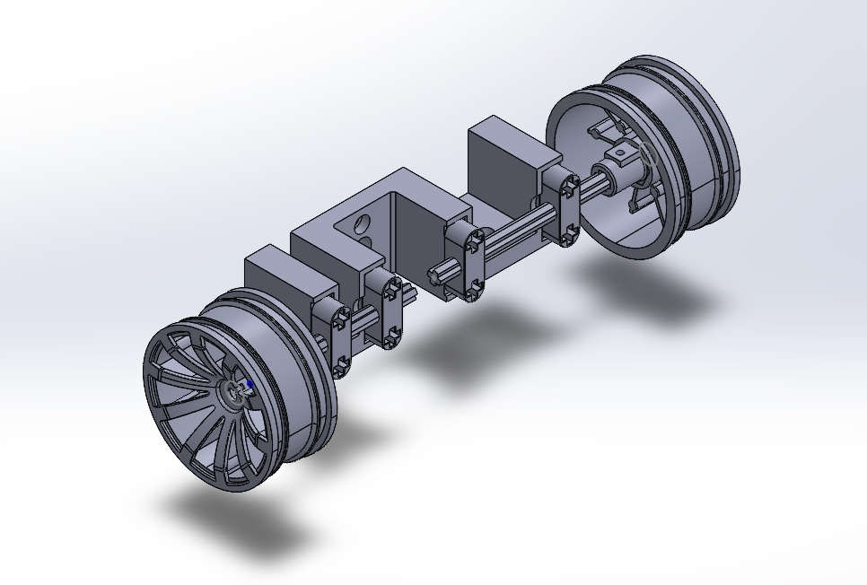
  <br>
  <strong>Rear Drive System Assembly</strong>
</p>

This assembly houses our custom single-motor drive system. It includes the 3D-printed gearbox, the differential gears, and the entire rear axle assembly, forming the core of our robot's propulsion.

---

<p align="center">
  
  <br>
  <strong>Sensor Tower & Base Assembly</strong>
</p>

This assembly serves as the main structural backbone. It combines the base plate that mounts to the chassis, the LiDAR mount, and the tall tower for the camera, ensuring all sensors are held in their optimal, rigid positions.

### 8.2. Key Individual Components

Below are the blueprints for some of our most critical custom-designed parts, which define our robot's performance. All components have been designed with functionality, strength, and ease of 3D printing in mind.

---

#### 8.2.1. Base Mounting Plate

**Role:** This plate serves as the foundation for attaching all sensor mounts. It ensures precise positioning and rigid fixation to the main chassis.

<p align="center">
  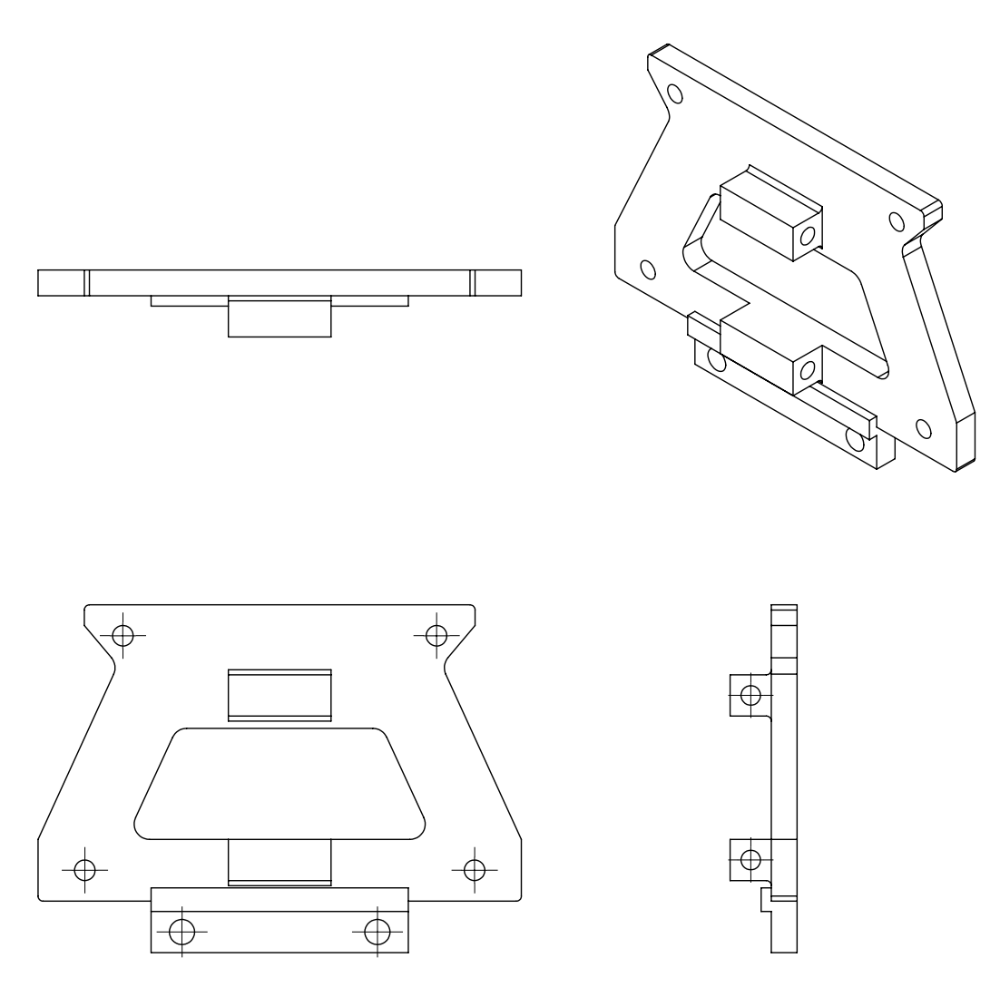
</p>

---

#### 8.2.2. Camera Tower

**Role:** This component provides the necessary height for the camera. It features a lightweight truss structure to minimize weight at the top of the robot.

<p align="center">
  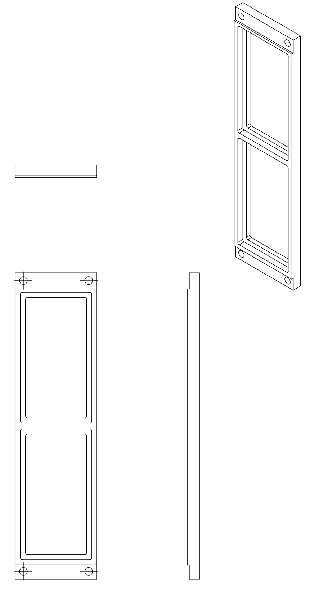
</p>

---

#### 8.2.3. Camera Mount

**Role:** This part securely holds the camera and is designed to integrate with the tilt servo, enabling vertical camera movement.

<p align="center">
  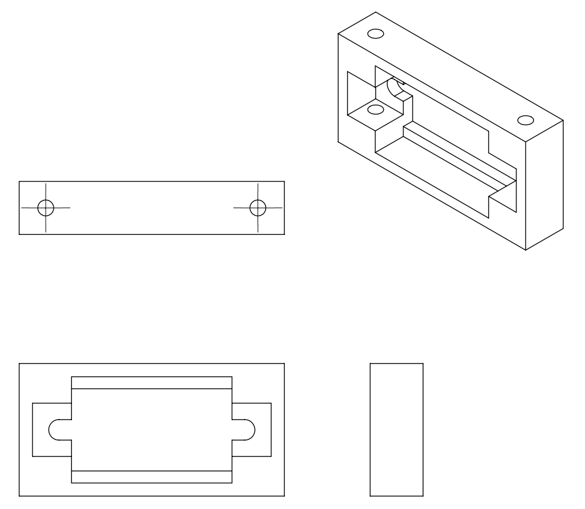
</p>

---

#### 8.2.4. LiDAR Mount (Mid Frame)

**Role:** This component positions the LiDAR sensor at the optimal height to reliably detect both the course walls and the obstacles on the track.

<p align="center">
  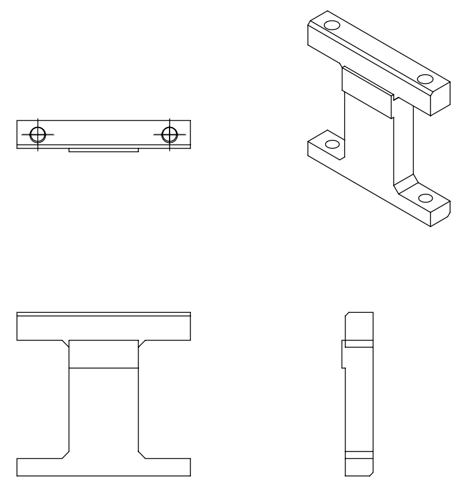
</p>

---

#### 8.2.5. LiDAR Mount (Upper Frame)

**Role:** This part suspends the LiDAR sensor in an inverted position. Its shape is designed to hold the LiDAR stably while minimizing the risk of the mount itself interfering with obstacles.

<p align="center">
  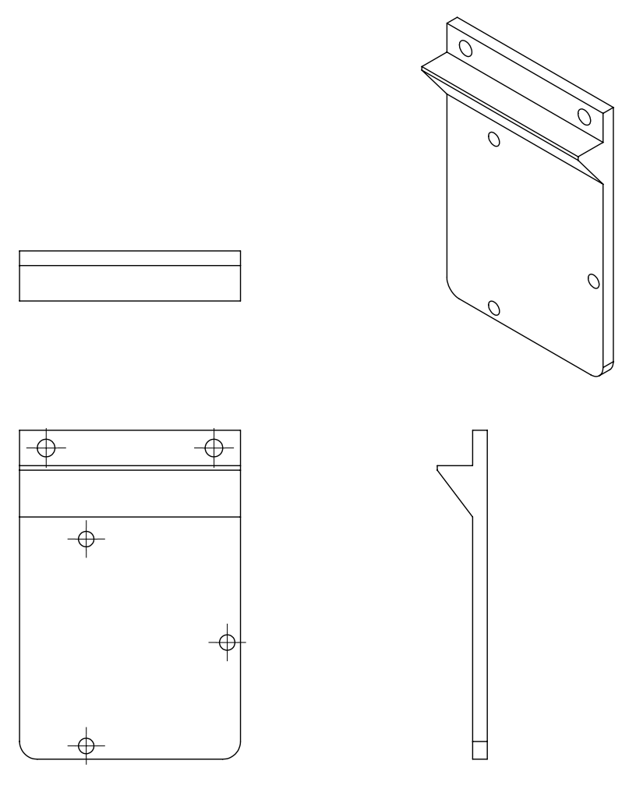
</p>

---

#### 8.2.6. Differential Gearbox

**Role:** This housing protects the drive motor and differential gears. It is designed with high dimensional accuracy to maintain precise gear mesh.

<p align="center">
  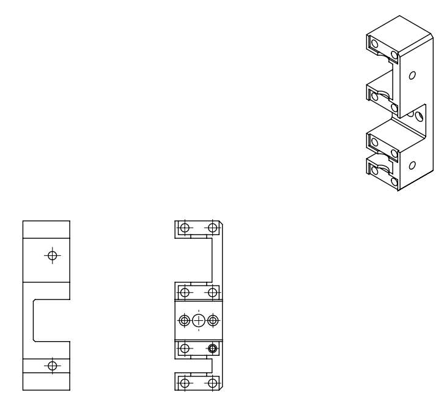
</p>

---

#### 8.2.7. Bevel Gear

**Role:** As one of the most critical gears in the drive system, it translates the motor's rotation by 90 degrees to transfer power to the differential mechanism. The tooth profile is optimized for smooth power transmission.

<p align="center">
  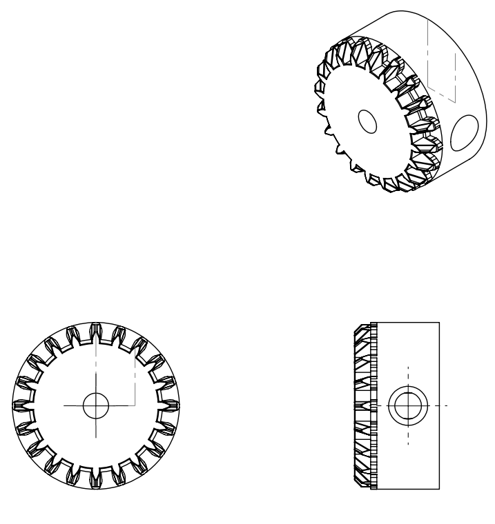
</p>

---

## 9. Performance Videos

This section provides video evidence of our robot's performance, demonstrating the successful implementation of all the strategies and designs discussed in this document. The videos show complete runs for each of the main challenges.

---

### 9.1. Obstacle Challenge

This video demonstrates our robot navigating the complex obstacle course. Key moments, such as the proactive corner scanning, dynamic turning strategies, and smooth two-phase avoidance maneuvers, are highlighted.

> **[Click to watch the Obstacle Challenge video on YouTube](https://youtu.be/rJHoL39SJ84)**

<a href="https://youtu.be/rJHoL39SJ84">
  <p align="center">
    
  </p>
</a>

---

### 9.2. Open Challenge

This video showcases the robot's pure speed and cornering ability on the course without obstacles. It highlights the stability of our PID wall-following algorithm and the efficiency of our chassis and drive system at high speed.

> **[Click to watch the Open Challenge video on YouTube](https://youtu.be/WeeWG6k68Qk)**

<a href="https://youtu.be/WeeWG6k68Qk">
  <p align="center">
    
  </p>
</a>

---

## 10. References

This project was built upon the shoulders of giants. This section provides links to the key official documentation, product pages, and community resources that were essential to our development process.

### Official Rules & Frameworks
*   **[WRO 2025 Future Engineers - General Rules](https://wro-association.org/wp-content/uploads/WRO-2025-Future-Engineers-Self-Driving-Cars-General-Rules.pdf)**: The official rulebook that governed all aspects of our design and strategy.
*   **[ROS 2 Documentation](https://docs.ros.org/)**: The official documentation for the Robot Operating System 2, the core framework of our software.

### Key Hardware Components & Datasheets
*   **[Hiwonder MentorPi A1 Robotic Kit](https://www.hiwonder.com/products/mentorpi-a1-monocular-camera-version?variant=41370001244247)**: The base platform for our robot, including the chassis, camera, and several motors.
*   **[Hiwonder RRC Lite Controller](https://www.hiwonder.com/products/rrc-lite)**: The central interface board for power management and low-level control.
*   **[Raspberry Pi 5](https://www.raspberrypi.com/products/raspberry-pi-5/)**: The main single-board computer (SBC) that runs our ROS 2 navigation node.
*   **[STL-19P D500 LiDAR](https://www.hiwonder.com/products/ld19-d300-lidar?_pos=1&_sid=6968f314c&_ss=r)**: The primary 360° distance sensor for environmental mapping.
*   **[BNO055 9-Axis IMU](https://akizukidenshi.com/catalog/g/g116996/)**: The external Inertial Measurement Unit used for precise orientation tracking.

### Key Software & Libraries
*   **[SOLIDWORKS](https://www.solidworks.com/)**: The CAD software used to design all our custom 3D-printed parts.
*   **[OpenCV Library](https://opencv.org/)**: The open-source computer vision library used for obstacle color detection.
*   **[Draw.io (Diagrams.net)](https://app.diagrams.net/)**: The tool used to create the diagrams and flowcharts in this document.
