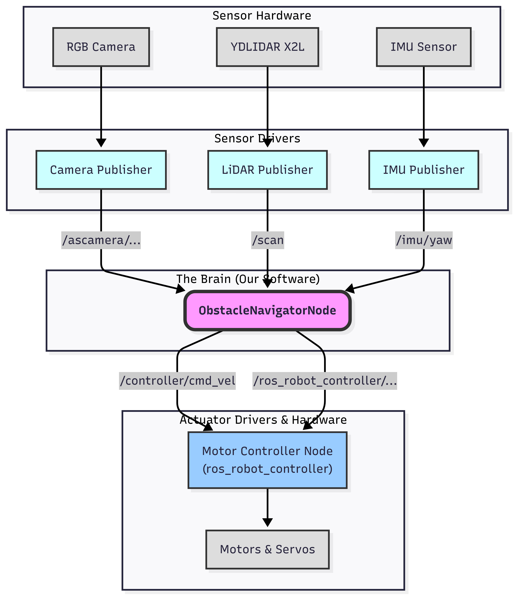

# WRO 2025 Future Engineers: Team Ishikawa KOSEN 

<!-- A captivating main image of your robot -->


<!-- Social media badges (optional but nice) -->
[](https://youtube.com/your-channel-link)
[](https://instagram.com/your-profile-link)

This is the official repository for **Team Ishikawa KOSEN**, representing Japan in the World Robot Olympiad (WRO) 2025 Future Engineers category. This document provides a comprehensive overview of our robot's design, strategy, and implementation, developed by Shinichi Uno and Kosei Takano.

---

## 1. Team Members & Roles

<!-- A formal picture of the team -->


*   **[Member 1 Name]:** Lead Programmer & Strategist
*   **[Member 2 Name]:** Mechanical Designer & Systems Integrator
*   ... (add more members and their primary roles)

> [!NOTE]
> For more team pictures, including our journey, please visit the [`t-photos`](./t-photos) directory.

---

## 2. Repository Structure

A brief guide to navigating our project repository.

*   `src/`: Contains the core ROS 2 source code, including our main `obstacle_navigator_node`.
*   `models/`: 3D CAD files for all custom-designed and 3D-printed parts.
*   `schemes/`: Circuit diagrams, system architecture diagrams, and state-machine flowcharts.
*   `v-photos/`: A gallery of our robot from all angles.
*   `t-photos/`: Photos of our team.
*   `video/`: Performance videos demonstrating the robot's capabilities.
*   `README.md`: This file, detailing our entire engineering process.

---

## 3. Bill of Materials (BOM)

A complete list of all electrical and mechanical components used in our robot.

| Component | Image | Quantity | Link/Datasheet |
| :--- | :---: | :---: | :--- |
| **Control Unit** | | | |
| Hiwonder MentorPi A1 | `(image here)` | 1 | [Product Page](link) |
| Raspberry Pi 4B | `(image here)` | 1 | [Product Page](link) |
| **Sensors** | | | |
| YDLIDAR X2L | `(image here)` | 1 | [Datasheet](link) |
| RGB Camera | `(image here)` | 1 | [Product Page](link) |
| **Actuators** | | | |
| DC Motors (w/ Encoders) | `(image here)` | 2 | [Product Page](link) |
| Steering Servo | `(image here)` | 1 | [Product Page](link) |
| Pan/Tilt Servos | `(image here)` | 2 | [Product Page](link) |
| ... (add all other components) | | | |

---

## 4. Vehicle Overview & Photos

A high-level introduction to our robot's design philosophy and key features.

| Front View | Right View | Rear View |
| :---: | :---: | :---: |
| `(image)` | `(image)` | `(image)` |
| **Left View** | **Top View** | **Bottom View** |
| `(image)` | `(image)` | `(image)` |

> [!NOTE]
> For more detailed photos, including close-ups of specific mechanisms, please see the [`v-photos`](./v-photos) directory.

---

## 5. Mobility Management

This section covers our robot's mechanical design and movement capabilities.

### 5.1. Chassis Design
*   (Explanation of why the MentorPi A1 was chosen, any modifications made, and the rationale behind the overall structure.)
*   (Include 3D model renders from the `models` directory.)

### 5.2. Drive System
*   (Details about the motors, wheels, and power transmission. Explain the selection process based on torque, speed, and efficiency requirements.)

### 5.3. Steering System
*   (Description of the steering mechanism, servo selection, and any custom parts designed to improve precision and durability.)

---

## 6. Power and Sense Management

This section details the electrical systems and the sensors that allow our robot to perceive its environment.

### 6.1. Circuit Diagram
*   (Embed a clear and professional circuit diagram from the `schemes` directory.)
*   (Provide a brief explanation of the power distribution, connections between the Raspberry Pi, motor controller, and sensors.)

### 6.2. Sensor Suite
*   **YDLIDAR X2L:** Explain its role in wall detection, corner detection, and localization.
*   **RGB Camera:** Describe how it's used for obstacle color detection and strategic planning.
*   **IMU & Encoders:** Detail their contribution to precise odometry and heading control.

---

## 7. Obstacle Management Strategy

This is the core of our autonomous navigation logic, implemented in the `obstacle_navigator_node.py`.

### 7.1. Overall Strategy: A Hierarchical State Machine

To navigate the complex and dynamic environment of the WRO course, our robot employs a **Hierarchical State Machine (HSM)**. This software architecture allows us to systematically manage the robot's behavior by breaking down the overall task into a series of distinct, manageable states. The robot always knows its current state and transitions to the next state based on clear, predefined conditions derived from sensor data.

This approach ensures robust, predictable, and debuggable behavior. The system is built around six main states, each responsible for a specific phase of the mission.

**Main States Overview:**

*   **`PREPARATION`**: Initializes all systems, including the camera and sensors, and determines the overall course direction (CW/CCW) at the start. (Parking Start Only)
*   **`UNPARKING`**: Executes a dynamic, pre-planned strategy to safely exit the parking area and enter the main course. (Parking Start Only)
*   **`STRAIGHT`**: The primary driving state. The robot follows the wall using PID control, detects upcoming corners, and plans its avoidance strategy for the next segment.
*   **`TURNING`**: Executes a precise, multi-step pivot turn to navigate the 90-degree corners of the course.
*   **`PARKING`**: Upon completing the required number of laps, this state manages the final maneuver to park the robot safely in the designated area.
*   **`FINISHED`**: The final state where all motors are stopped, concluding the run.

The core of our robot's operation is the cyclical transition between the `STRAIGHT` and `TURNING` states, which allows it to repeatedly navigate the course segments and corners.

**High-Level State Transition Flowchart:**


### 7.2. The ROS 2 Ecosystem: How Our Nodes Collaborate

Our autonomous navigation system is built entirely on the **Robot Operating System 2 (ROS 2)**, an advanced, open-source framework for robotics. ROS 2 allows us to structure our software in a modular and robust way, where independent programs called **Nodes** communicate with each other in real-time.

The core of this communication is the **Publish/Subscribe (Pub/Sub)** model. Sensor nodes "publish" data onto named channels called **Topics**, and our main logic node "subscribes" to these topics to receive the data. Similarly, our logic node publishes control commands, which the motor controller node subscribes to. This decoupled architecture makes the system highly flexible, scalable, and easy to debug.

Our system consists of three primary nodes that work in concert:

1.  **Sensor Drivers Node(s):** Responsible for interfacing with the hardware (LiDAR, IMU, Camera) and publishing their raw data to ROS 2 topics.
2.  **`ObstacleNavigatorNode` (The Brain):** This is the central logic node that we developed. It subscribes to all sensor data, processes it through the hierarchical state machine, makes decisions, and publishes velocity and servo commands.
3.  **Motor Controller Node (`ros_robot_controller`):** This node subscribes to the commands from our "Brain" and translates them into low-level electrical signals to control the motors and servos.

The following diagram illustrates the flow of data between these nodes.

**Node and Topic Communication Diagram:**



### 7.3. Dynamic Strategy Selection

A key feature of our robot is its ability to dynamically select the optimal strategy in real-time, rather than following a single, hard-coded path. This adaptability is crucial for handling the various challenges on the course. We have implemented two primary dynamic selection systems: one for unparking and one for cornering.

#### 7.3.1. Unparking Strategy (4 Patterns)

**The Challenge:** Our initial approach was to exit the parking area first and then identify the obstacle color, but this resulted in significant time loss and inefficient movements. We realized that since the obstacle is visible from the starting position, a pre-emptive scan could optimize the entire sequence. The problem then became how to reliably select an exit strategy before moving, using only a single, potentially noisy, initial observation.

**Our Solution:** To address this, our robot executes a pre-unparking check to gather data and select one of four specialized exit strategies.

1.  **Direction Detection:** The robot first uses its LiDAR to determine the course direction by measuring the distance to the side walls.
2.  **Obstacle Proximity Scan:** It then aims its camera towards the exit and analyzes the size of the detected obstacle blob to determine if it is "close" or "far".
3.  **Strategy Selection:** Based on these two pieces of information, the robot selects the most appropriate strategy from the following decision matrix:

| Course Direction | Obstacle Presence | Selected Strategy | Description |
| :--- | :--- | :--- | :--- |
| **Clockwise** | Far | `STANDARD_EXIT_TO_OUTER_LANE` | A standard turn onto the wider outer lane. |
| **Clockwise** | Far (Red Obstacle) | `STANDARD_EXIT_TO_INNER_LANE` | A standard turn onto the tighter inner lane. |
| **Clockwise** | Close (Red Obstacle) | `AVOID_EXIT_OBSTACLE_TO_INNER_LANE_CW` | A complex maneuver involving a forward push and turn to clear the obstacle. |
| **Counter-Clockwise**| Far | `STANDARD_EXIT_TO_OUTER_LANE` | A standard turn onto the wider outer lane. |
| **Counter-Clockwise**| Close | `AVOID_EXIT_OBSTACLE_TO_INNER_LANE_CCW`| A reverse maneuver to create space before turning onto the inner lane. |

This intelligent selection process ensures a safe and efficient exit from the parking area, regardless of the initial conditions.

#### 7.3.2. Turning Strategy (8 Patterns)

**The Challenge:** Simply making a 90-degree turn at every corner is inefficient. The optimal turning maneuver (e.g., approach distance, turn angle) depends on the robot's current path, its planned path for the *next* segment, and any obstacles present at the corner's entrance.

**Our Solution:** Our `_get_turn_strategy()` function acts as a dynamic decision-maker before every turn. It analyzes three key factors to select the best set of turning parameters from 8 possible combinations:

1.  **Current Lane:** Is the robot currently on the `Outer` or `Inner` path?
2.  **Next Lane Plan:** Is the plan for the next segment `Outer`, `Inner`, `Outer-to-Inner`, or `Inner-to-Outer`?
3.  **Entrance Obstacle:** Is there an obstacle detected at the entrance of the corner that requires a wider turn?

Based on these factors, the robot adjusts its behavior, allowing for tighter, faster turns when the path is clear, and safer, wider turns when navigating complex transitions or obstacles. This logic is the core of our robot's lap-time performance and reliability.

*(A detailed table of the 8 patterns could be added here later if needed, but this conceptual explanation is a strong start.)*

### 7.4. Key Algorithms & Engineering Decisions

Our robot's reliability is not the result of a single piece of code, but the evolution of several key algorithms born from trial and error. This section details the engineering decisions behind our most critical navigation functions.

#### 7.4.1. Corner Detection: From Fragile Vision to Robust LiDAR Logic

**Initial Idea & Failure:** Our first attempt at corner detection used the camera to find colored lines on the course floor. However, this proved unreliable. The lines were often obscured by obstacles, and varying lighting conditions caused frequent misdetections.

**Evolution to LiDAR & The "Double-Detection" Problem:** We then pivoted to a LiDAR-based approach: a corner is detected when the inner wall is no longer visible. While this worked reasonably well, it introduced a new, critical bug: when turning a corner from the outer lane, the robot would sometimes detect the *same corner twice*, causing it to fail.

**Final Solution:** To solve this, we implemented a counter mechanism. A corner is only confirmed when the inner wall has been out of sight for a *sustained number of consecutive scans*. This simple addition eliminated the double-detection bug and made our cornering logic exceptionally robust.

Here is the simplified logic in pseudo code:

```python
def check_for_corner(scan_data, state):
    """Detects a corner using a counter for robustness."""
    
    # Get distances to the inner wall (where corners appear) and the front wall.
    inner_dist = get_distance_to_inner_wall(scan_data)
    front_dist = get_distance_to_front_wall(scan_data)

    # A corner might be ahead if the inner wall vanishes AND we are approaching a front wall.
    is_corner_imminent = (inner_dist > INNER_WALL_DISAPPEAR_THRESHOLD and
                          front_dist < FRONT_WALL_APPROACH_THRESHOLD)

    if is_corner_imminent:
        # If the condition is met, increment the confirmation counter.
        state.corner_detection_counter += 1
    else:
        # Otherwise, reset it immediately.
        state.corner_detection_counter = 0

    # Only confirm the corner if the condition has been true for a sustained period.
    # This prevents false positives from sensor noise or temporary occlusions.
    if state.corner_detection_counter >= CORNER_CONFIRMATION_COUNT:
        return "CORNER_DETECTED"
    
    return "NO_CORNER"
```

#### 7.4.2. Lane Change Safety: From Reactive to Predictive

**Initial Idea & Failure:** Originally, a lane change was triggered *after* the robot thought it had passed an obstacle. We attempted to detect this by monitoring the side LiDAR data for a `NORMAL -> NARROW -> NORMAL` distance pattern. However, this reactive approach was highly inaccurate, especially with small 5cm obstacles. The robot often missed the transition or reacted too late.

**Final Solution:** The unreliable reactive method was completely replaced by our current `_is_safe_for_lane_change()` function. Instead of trying to detect the *moment* of passing, we now predictively check if the upcoming space is **stable and wide enough for a sustained period**. This shift from a reactive to a predictive model drastically improved the safety and reliability of our lane change maneuvers.

```python
# --- Pseudo Code for Safe Lane Change ---
def is_safe_for_lane_change(scan_data, state):
    """Predictively checks if the upcoming path is stable enough for a lane change."""
    
    # Get distances to all relevant walls.
    inner_dist = get_distance_to_inner_wall(scan_data)
    outer_dist = get_distance_to_outer_wall(scan_data)
    front_dist = get_distance_to_front_wall(scan_data)
    
    # Check for two conditions:
    # 1. Is the course width normal (not in a corner or wide-open area)?
    is_width_normal = (NORMAL_COURSE_WIDTH_MIN < inner_dist + outer_dist < NORMAL_COURSE_WIDTH_MAX)
    # 2. Is the path ahead clear of any immediate obstacles?
    is_front_clear = front_dist > MIN_FRONT_CLEARANCE_FOR_LANE_CHANGE
    
    if is_width_normal and is_front_clear:
        # If the path is stable and clear, increment the stability counter.
        state.lane_change_stability_counter += 1
    else:
        # If conditions are not met, the path is unstable. Reset the counter.
        state.lane_change_stability_counter = 0
        
    # A lane change is only permitted if the path has been confirmed as stable
    # for a certain number of consecutive checks.
    if state.lane_change_stability_counter >= STABILITY_CONFIRMATION_COUNT:
        return True # It's safe to change lanes.
        
    return False # It's not safe yet.
```

#### 7.4.3. Sensor Fusion: Overcoming the "Black Wall Problem" with IMU

**The Challenge:** Our biggest initial hurdle was frequent loss of LiDAR data. A simple approach of reading distances at fixed angles (e.g., -90°, 0°, 90°) failed constantly. This was due to two compounding factors: the black walls of the course absorb light, and LiDAR signals weaken significantly when not hitting a surface perpendicularly.

**The "Aha!" Moment & Solution:** Through experimentation, we discovered that even the black walls provide reliable readings if, and only if, the laser hits them at a **perfect 90-degree angle**. This led to the development of our core sensor fusion function, `get_distance_at_world_angle()`.

This function uses the robot's real-time orientation from the **IMU** to continuously calculate the *exact LiDAR angle needed to hit the wall perpendicularly*, regardless of the robot's own orientation. By dynamically selecting the perfect laser beam at every moment, we transformed a "fatal flaw" of the LiDAR into a reliable navigation tool.

```python
# --- Pseudo Code for IMU + LiDAR Sensor Fusion ---
def get_distance_at_world_angle(world_angle_deg, current_yaw_deg, scan_data):
    """Gets a reliable wall distance by correcting for the robot's orientation."""

    # --- This is the core of the fusion logic ---
    # To hit a wall at a specific "world" angle (e.g., 90 degrees),
    # calculate the angle the LiDAR must look at relative to the robot's own front.
    robot_local_angle = world_angle_deg - current_yaw_deg
    
    # Find the specific laser beam in the 360-degree scan that matches this local angle.
    lidar_index = find_lidar_index_for_angle(robot_local_angle, scan_data)
    
    # Get the primary distance measurement from that single, perfect beam.
    distance = scan_data.ranges[lidar_index]

    # As a fallback, if the primary beam failed (e.g., hit a seam in the wall),
    # check its immediate neighbors to get a valid reading.
    if not is_valid(distance):
        distance = check_neighboring_beams(lidar_index, scan_data)

    return distance
```

#### 7.4.4. Dynamic Turning Strategy (8 Patterns): Optimizing for Speed and Safety

**The Need for Optimization:** Initially, we used a single, safe turning method for all corners. While reliable, it was slow. We quickly realized that to be competitive, the robot needed to be aggressive on simple corners but cautious on complex ones.

**Final Solution:** This led to our 8-pattern dynamic turning system. For example, an `Outer-to-Outer` turn can be executed at high speed. However, an `Inner-to-Inner` turn, especially with a detected entrance obstacle, requires a much slower, more precise maneuver. By optimizing the path for each specific context, we achieved a significant reduction in lap times while simultaneously increasing the stability and safety of the robot.

```python
# --- Pseudo Code for Dynamic Turning Strategy ---
def get_turn_strategy(state, plan):
    """Selects the optimal turning parameters based on context."""

    # Look ahead: What is the plan for the segment *after* this turn?
    next_path_type = plan.for_next_segment()

    # The logic depends on where we are coming from and where we are going.
    if state.last_path_was_outer:
        if "outer" in next_path_type:
            # Outer --> Outer: A fast, wide turn is safe and efficient.
            return {"approach_dist": 0.6, "turn_angle": 30.0}
        else: # Going to inner
            # Outer --> Inner: A sharp, tight turn is needed. Approach closer.
            return {"approach_dist": 0.8, "turn_angle": 70.0}
    else: # Last path was inner
        if "outer" in next_path_type:
            # Inner --> Outer: A very early and sharp turn to cross the lane.
            return {"approach_dist": 0.3, "turn_angle": 70.0}
        else: # Going to inner
            # Inner --> Inner: The most cautious turn to stay tight against the inner wall.
            return {"approach_dist": 0.85, "turn_angle": 70.0}
```

### 7.5. Source Code with Detailed Comments

All the logic and strategies described above are implemented in a single, well-organized ROS 2 node: `obstacle_navigator_node.py`. We have placed a strong emphasis on code readability and maintainability, adhering to modern software development practices.

The complete, fully commented source code is available for review in our repository. The comments within the code provide a line-by-line explanation of:
*   The **purpose** of each function and state.
*   The **logic** behind critical calculations.
*   The **intent** of important parameters and thresholds.

This detailed documentation within the code itself ensures that our work can be understood, verified, and reproduced by the judges and the wider robotics community.

> [!IMPORTANT]
> **You can view the complete source code here:**
> **[src/obstacle_navigator_node.py](./src/chassis_v2_maneuver/chassis_v2_maneuver/obstacle_navigator_node.py)**

### 7.6. Future Improvements

While we are proud of our current system, the engineering process is one of continuous improvement. Based on our testing and development experience, we have identified several key areas for future enhancement. This demonstrates our commitment to pushing the boundaries of what our robot can achieve.

| Area for Improvement | Current Status & Limitations | Proposed Future Enhancement |
| :--- | :--- | :--- |
| **State Machine Robustness** | Our state machine is currently implemented with a series of `if/elif` statements. While effective, it can become complex to manage as more states are added. | Transition to a formal state machine library (like `SMACH` for ROS 2). This would provide greater robustness, clearer state transition definitions, and better visualization tools. |
| **Localization Accuracy** | We currently rely on a turn counter and corner detection for localization. This can be prone to errors if a corner is missed or misidentified. | Implement a more advanced localization algorithm, such as an **Extended Kalman Filter (EKF)**, to fuse data from the IMU, wheel encoders, and LiDAR. This would provide a much more accurate and reliable estimate of the robot's position on the course at all times. |
| **Parameter Tuning** | Our many control parameters (e.g., PID gains, turning speeds) are currently tuned manually through extensive trial and error. This process is time-consuming and may not yield the absolute optimal values. | Develop a simulation environment (e.g., in Gazebo) to automate the tuning process. Using optimization algorithms or machine learning (Reinforcement Learning), we could automatically discover the best set of parameters for maximum speed and stability. |

These planned improvements show that our current design is not an endpoint, but a solid foundation upon which even more advanced and intelligent behaviors can be built.

---

## 8. 3D Models & Custom Parts

*   (Showcase some of the most important custom-designed parts, such as sensor mounts or protective bumpers.)
*   (Include renders and a brief description of their purpose.)
*   (Provide a link to the `models` directory for access to all `.stl` or `.step` files.)

---

## 9. Performance Videos

*   (Embed or link to YouTube videos demonstrating the robot successfully completing the course.)
*   (It's recommended to have separate videos for different challenges, e.g., with and without obstacles, parking start, etc.)

---

## 10. References

*   [WRO 2025 Future Engineers Rules](link-to-rules)
*   [ROS 2 Documentation](https://docs.ros.org/)
*   (Any other significant libraries, tutorials, or resources used.)