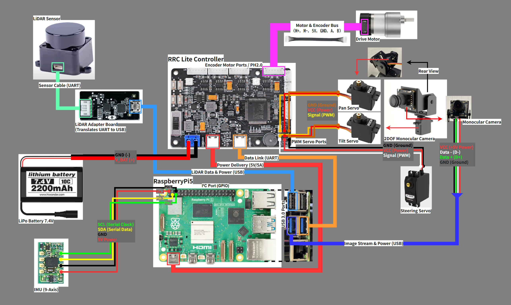
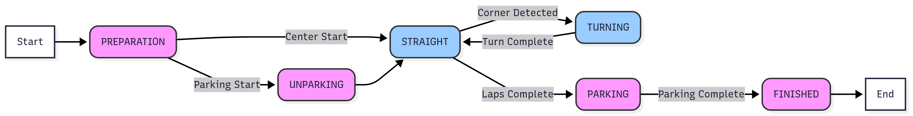
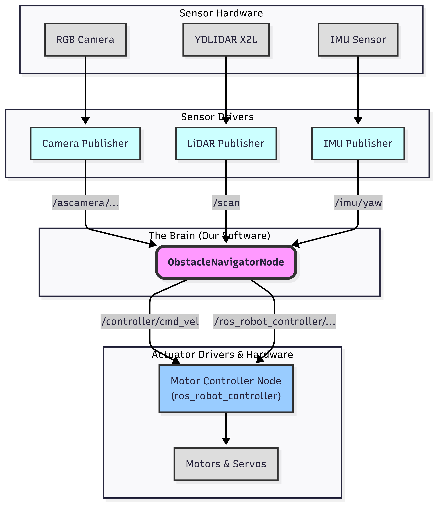

# System Schematics and Design Diagrams

This directory contains all the schematics, flowcharts, and diagrams that visually represent the design and logic of our robot. These diagrams are essential companions to the main project `README.md` and provide a deeper insight into our engineering process.

---

## Main Wiring Diagram

This is the master schematic illustrating the complete electrical connections between all major components of our robot. This centralized wiring, managed by the RRC Lite Controller, simplifies the overall structure and enhances reliability.

> For a detailed explanation of the power system and sensor suite, see [**Section 6: Power and Sense Management**](../../README.md#6-power-and-sense-management) in the main documentation.

  
   
  <em>The complete electrical schematic showing connections between all major hardware components.</em>

---

## System Architecture & Logic Flow

These diagrams illustrate the software architecture and the strategic logic that governs the robot's behavior. The State Machine Flowchart provides a high-level overview of the robot's operational states, while the Node Architecture diagram shows how data flows between different software modules in ROS 2.

> For a detailed explanation of our software architecture and state machine, see [**Section 7.1 & 7.2**](../../README.md#71-overall-strategy-a-hierarchical-state-machine) in the main documentation.

  
   
  <em>A high-level flowchart of the robot's main operational states, from Preparation to Finished.</em>

  
   
  <em>Illustrates the flow of data between our custom ROS 2 nodes and hardware drivers.</em>

